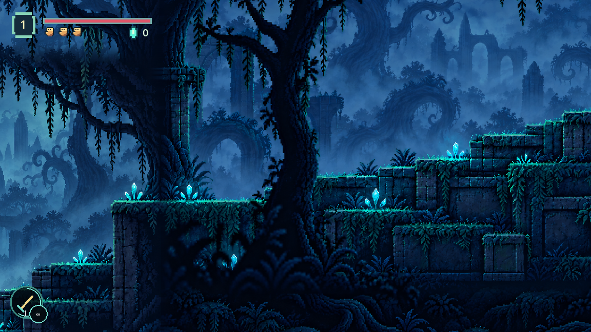
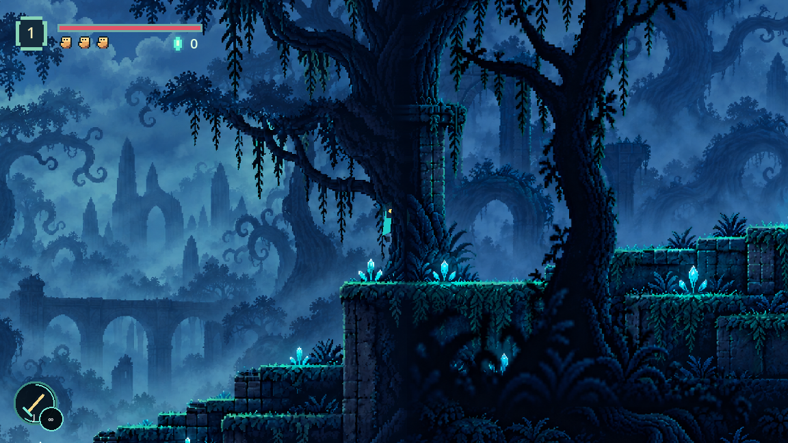
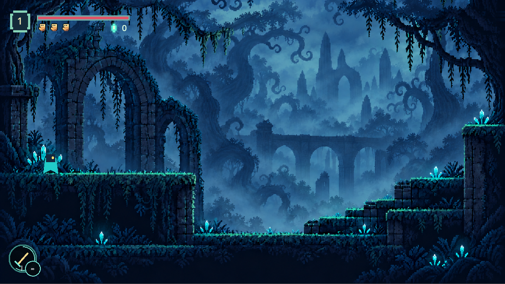

# Forest Room 1: foreground and scenery correction

The foreground trees now use texture-registered Polygon2D masks at z20 above terrain and the traveller. Near trunks cover both the passing player and the floor behind them; the artificial bright crest lines have been removed. Collision stays continuous behind these decorative occluders. Safe paths remain visible before and after each trunk.

The upper-band crossfade was subsequently rejected because incompatible branches doubled and formed a visible stripe. Section 1 now samples its entire coherent authored painting, from sky to foundation, with no upper splice or horizontal fade. The Section 1 foreground mask uses the same painting and transform. Collision, camera bounds and the continuous route remain unchanged. Section 2 retains its separate registered artwork and foundation extension. No reflection, mirroring or repeated-image extension remains.

Assets saved in the root project:

- `assets/forest_room1_canopy_extended.png`: the entire coherent Section 1 painting is now used.
- `assets/forest_room1_foundation_extended.png`: only its new lower region is used.

Mode: built-in imagegen. Inputs: existing character-free Section 1 and Section 2 assets respectively, both used as edit targets. Original assets and user files are preserved. Native generation sizes are normalized to the logical 1672x1203 extent. Section 1 uses one transform throughout; its visible support edges and registered foreground mask are checked against the unchanged collision in the running game. The previous generation prompts below describe asset provenance, not the rejected shader splice.

Exact canopy prompt:

> Use case: precise-object-edit. Asset type: pixel-art game environment extension. Input image is an EDIT TARGET. Extend its canvas UPWARD by exactly 262 source pixels: requested output 1672x1203, original 1672x941 image unchanged at x0,y262. Create NEW upper scenery showing the natural tops of the forest trees, branching canopy silhouettes and softly layered blue sky/clouds beyond. Existing trunks and roots continue upward in their natural orientation into crowns; maintain navy/slate blue pixel art, lighting, crisp pixel detail and atmosphere. The original image below y262 must remain unchanged, especially ALL platform contours, foreground roots, masonry, crystals and scenery registration. Only add the top band. Never flip, mirror, reflect or repeat any existing pixels or composition. No characters, UI, text, new platforms, landmarks or extra crystals. No resizing or recentering original artwork. Join the newly painted band naturally to the existing canopy, with no horizontal boundary.

Exact foundation prompt:

> Use case: precise-object-edit. Asset type: pixel-art game environment extension. Input is an EDIT TARGET. Extend canvas DOWNWARD by exactly 262 source pixels. Output 1672x1203. Original 1672x941 image remains unchanged at x0,y0. Only paint the newly added bottom band: continue its dark forest roots, rock foundations and sparse shadowed fern shapes downward naturally. Preserve navy/slate-blue pixel-art style, scale, atmosphere and crisp pixels. Keep the original image unchanged, including all platforms, trunk silhouettes, moss, crystals and distant ruins. Never flip, mirror, reflect or repeat the existing image. No new glowing crystals, no platforms, no characters, no UI or text. No recentering or resizing. New lower band is dark supporting depth, joins without a horizontal boundary.

Verification: real-controller forest_arrival_smoke passes both sections, both outer transitions, no seam transition, art registration and checkpoint/state persistence. The running-game occlusion test compares player-visible and player-hidden frames at all three near-tree crossings, requiring unchanged pixels strictly inside the foreground masks. The final running-game traversal and refreshed gameplay-scale screenshots are recorded alongside this correction.

