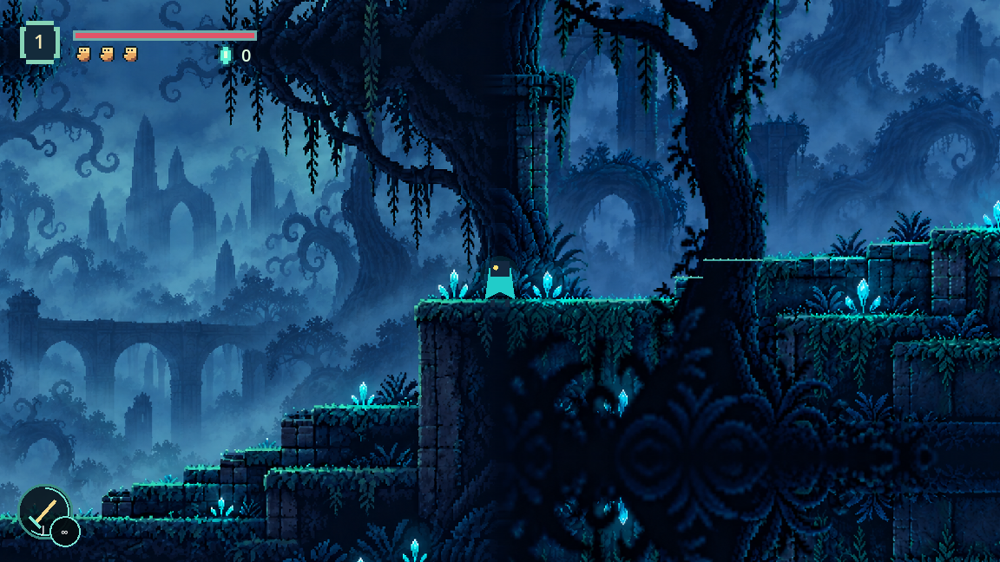
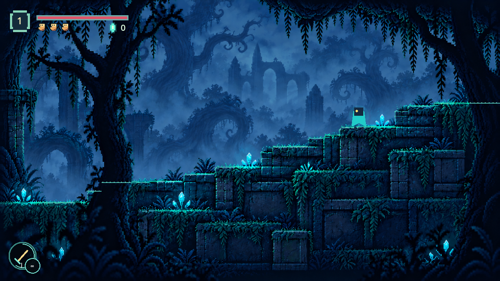
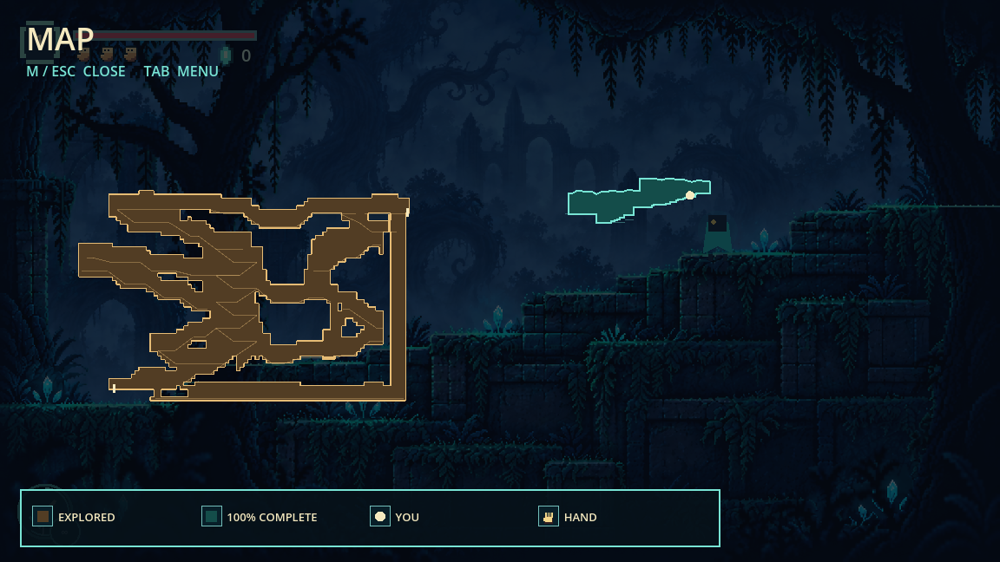

# Forest Room 1: continuous Sections 1 and 2

Historical two-section review. The current three-section room and verification are recorded in [Forest Section 3](forest-section3.md).

One room, x0..2400. Section seam x1200 does not change room ID, lock controls,
fade, teleport or reset camera smoothing. Source floor y416 in Section 1 matches
y678 in Section 2 through their independently registered origins. Room 2 starts
only at x2400. Existing subsequent rooms shift +1200 with their local content intact.

Both supplied compositions are retained. Section 1 uses one coherent canopy-to-foundation
painting rather than an upper splice or crossfade. Roots join across the narrow section
threshold; authored scenery covers the taller camera envelope without reflection. Section 2's live crest follows the upper mossy steps.
Near trees occlude the floor and traveller through separate foreground masks;
lower masonry terraces are supporting facade. The artificial footing traces are
removed. See the [foreground and scenery correction](forest-room1-art-correction.md)
for the current visual review and asset prompts.
The shader uses one world-space quad, with collision and map authored under identical
source transforms. A first stitched image was rejected because it moved terrain.

Passed: forest_arrival_smoke (both sections both ways, no seam transition, actual
Room 2 return and cave exit, art dimensions, checkpoint/state persistence),
forest_regression_smoke (death during transition and both hands), twisted_forest_smoke
(boss, bow, meditation, completion and persistence), and real-time cave_rooms_smoke.
The final running-game visual driver completed both full routes without failure.
Slot0 was active during visual review; fixtures used isolated save directories.

## Section 2 asset provenance

Asset: `assets/forest_room1_section2.png`, 1672x941.
Mode: built-in imagegen, supplied Section 2 as edit target.
Original remains untouched at `C:/NCAT/metroid/forest room 1/forest room 1 section 2.png`.
Section 1's asset and exact prompt are documented in [its initial review](forest-section1.md).

Exact Section 2 prompt:

> Edit this exact 1672x941 pixel art image. Only remove the little teal player character near x188,y648 on the bottom-left arrival platform. Restore the mist and platform behind that character. Preserve every other pixel's composition, including ALL platform contours, roots, colors, crystals, background ruins, and image dimensions. Do not redesign, stitch, extend, crop, or move any terrain. Output the same composition with no character and no text.
