# Forest Room 1: camera, collision and foreground corrections

The recessed spire and vertical arch masonry are now behind the player and have no blocking collision. The moss crown and terraces remain supporting terrain. The arch climb passes from the terrace at source x1200,y425; approaching too early from the terrace edge hits the crown underside, so the controller test uses a takeoff with enough room to rise.

The low hidden canopy collision beside the shared tree is removed. Landing foliage and the recessed overhang remain in the background. True near trunks still cover terrain, player and glow.

The x3000 camera switch is removed. Room 1 uses a constant top limit of -620 and normal smoothing. Three complete authored canopy/sky paintings supply the extra view; no reflection, upper splice, blur or horizontal crossfade conceals the extension. Original source-textured support volumes retain authoritative terrain registration and foundations.

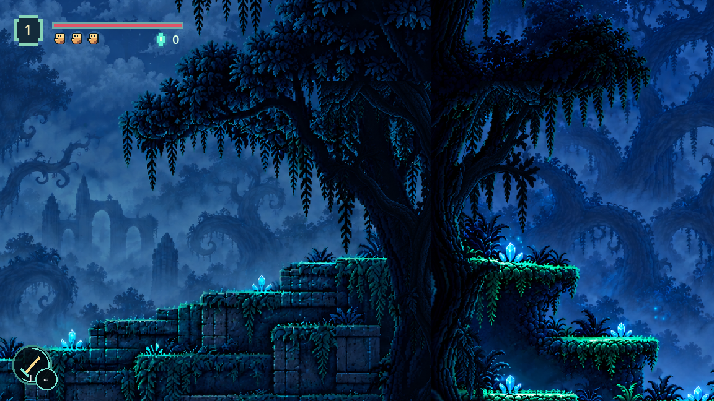
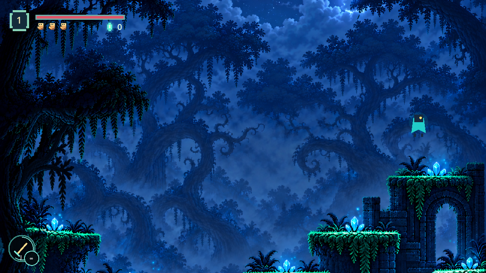
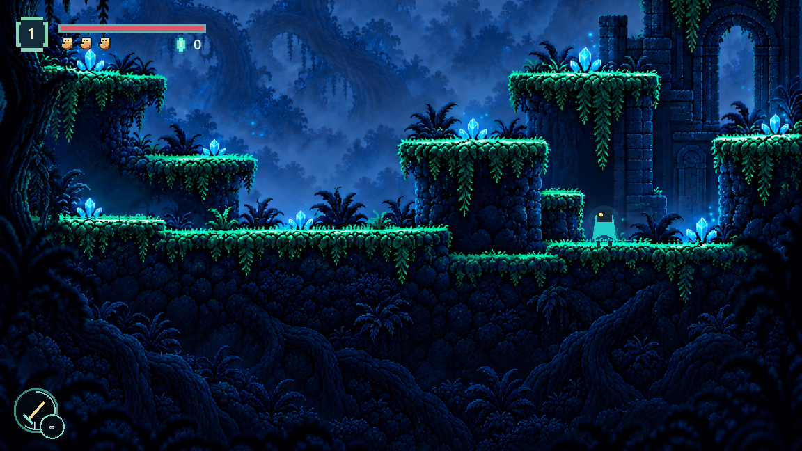
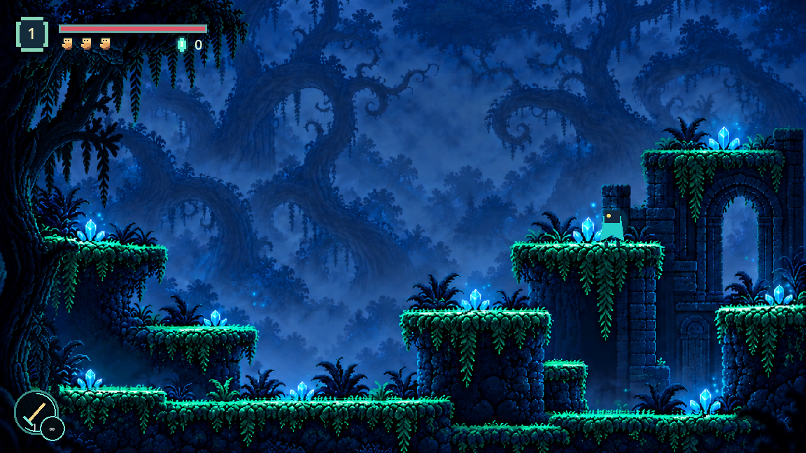

## Verification

Headless forest arrival route passed outward and back through every section, Room 2 exit/return and cave checkpoint persistence. The full three-section controller traversal also passed both ways in the running game. Forest regression and twisted forest checks passed. In the running game, actual jump input at the high Section 2 ledge, shared tree and arch crown produced approximately 104px rise and 87px upward camera follow. The player walked through the decorative spire. Pixel comparisons passed for true foreground trunk coverage and player visibility at the lower arch, return foothold and recessed spire. Review uses inactive save slot 0.

## Follow-up: current bark registration and side clearance

The foreground polygons now sample the current complete sky paintings with the
background shader's native-to-world registration. Stale original-painting masks
are replaced at the Section 2 near tree and the shared threshold's neighboring
trunks. True near bark covers the player and terrain; recessed foliage stays behind.

The Section 3 left threshold retains its shallow solid moss cap, with recessed roots
below it nonblocking. The central pillar collider follows its tapered left side.
Player dimensions and movement are unchanged.

Verification: full headless arrival traversal passed both ways, Room 2 exit/return,
cave checkpoint persistence, full-body pocket queries and two-way pillar approaches.
The running-game full route and targeted lower-clearing/shelf/threshold jumps passed.
Independent current-painting bark-edge/open-air pixel comparisons passed, alongside
the trunk coverage and landing visibility checks. Forest regression and twisted
forest checks passed. Headless runs also report the existing certificate-store and
shutdown resource warnings. Review uses inactive slot 0; real saves are untouched.

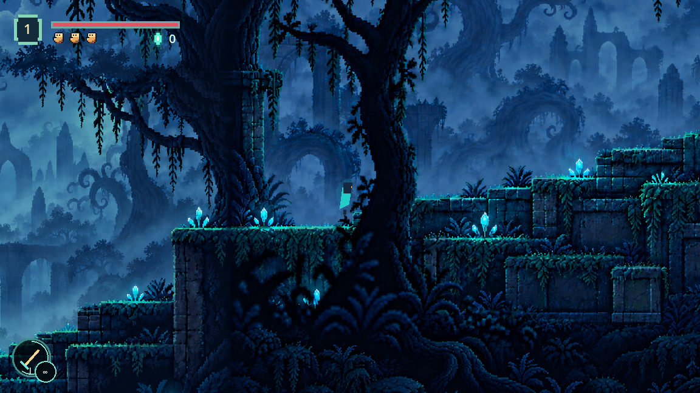
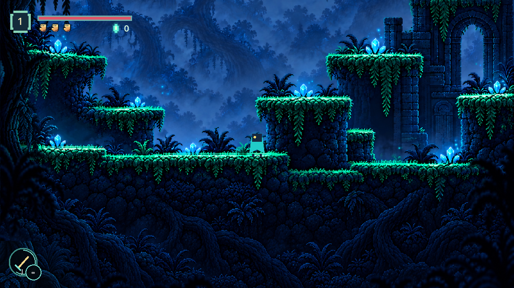
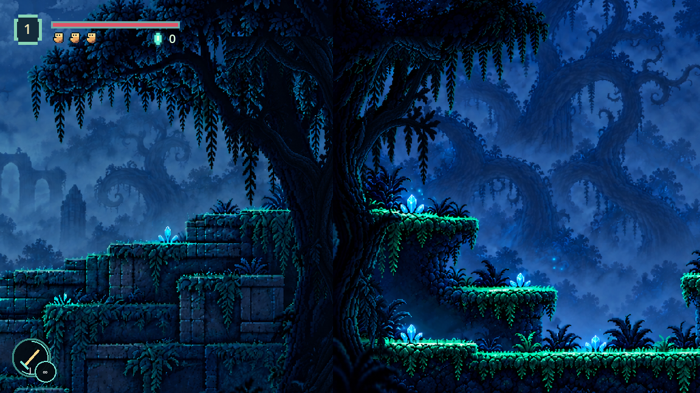

### Eastern Section 2 branch follow-up

The subsequent Section 2 east-tree review exposed an omitted left branch, despite
the corrected texture registration. Independent bark sample (1140,450) reproduced
58 visible player pixels before the correction. The eastern polygon now includes
that branch; the sample reports no player leakage, while open air at (1120,520)
keeps the player visible. The existing trunk and landing pixel checks also pass.
Earlier samples on the first tree and shared trunk did not validate this branch.

### Correct object and Section 1/2 background assignment

The user's screenshot identifies the trunk beside Section 2's ascending steps,
formerly `Section2NearTree`, rather than `Section2EastTree`. The earlier eastern
branch correction did not address the reported object. The user now explicitly
assigns this trunk and the tree at Section 1's end to the background. Their two
foreground polygons are removed; their full artwork remains in the background
plate. Player, effects and terrain draw in front of both, with no partial silhouette
switching depth. Collision, camera and movement are unchanged.
Small source-textured moss/stone caps restore the Section 2 walking surface where
the flattened painting had baked the trunk over it; their elevations match collision.

The updated rendered checks require player visibility over both former occluders,
while retaining opaque bark and open-air checks at the Section 2/3 foreground.
The full headless arrival traversal, pocket clearance, doorway return and checkpoint
persistence checks pass. The memory now requires locating the exact screenshot
object using its surrounding landmarks before editing and verifying that same view.
The running-game controller also completed the room in both directions.

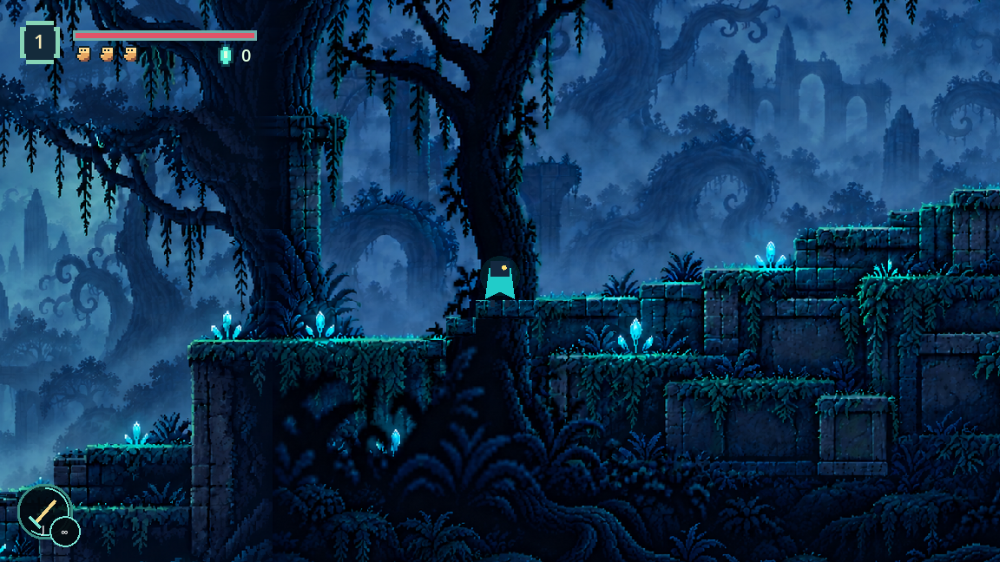
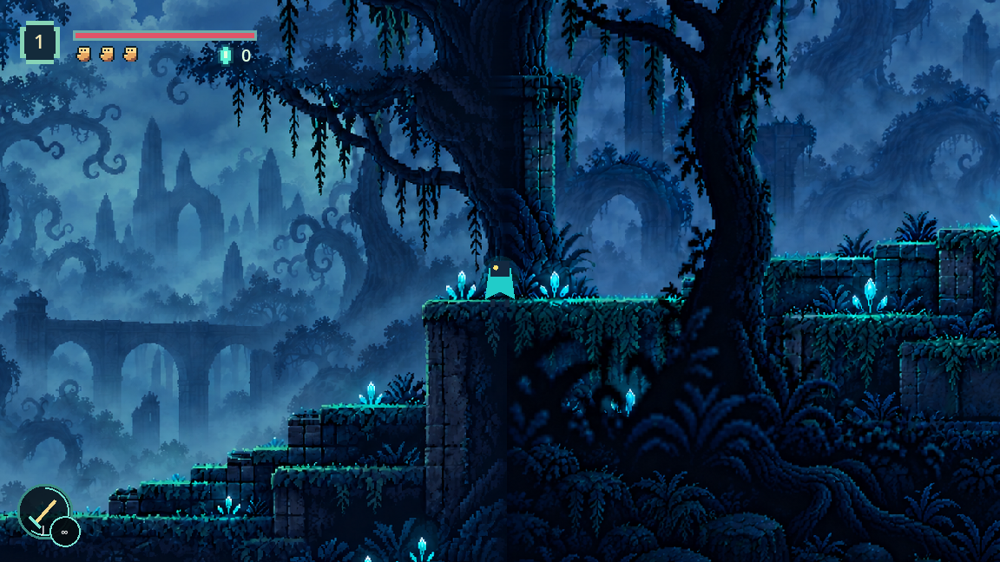

### Latest assignment: pictured step-side trunk is foreground

The latest explicit screenshot correction supersedes the background assignment
above for `Section2NearTree` only. That trunk is foreground again, sampling the
current painting at its exact registration. The added moss/stone floor patches
through it are removed. The Section 1 end tree remains background. Collision and
movement are unchanged. The middle trunk outline follows the inward curve rather
than covering the open-air pocket beside it.

Rendered comparisons pass for bark at native (235,850), (280,740), (330,790),
and player visibility in open air at (250,750), (350,790). The Section 1 end-tree
visibility check and retained shared-trunk checks pass. Full headless arrival route,
two-way clearance, doorway return and checkpoint persistence checks pass.
The running-game controller completed the full room both ways with this assignment.

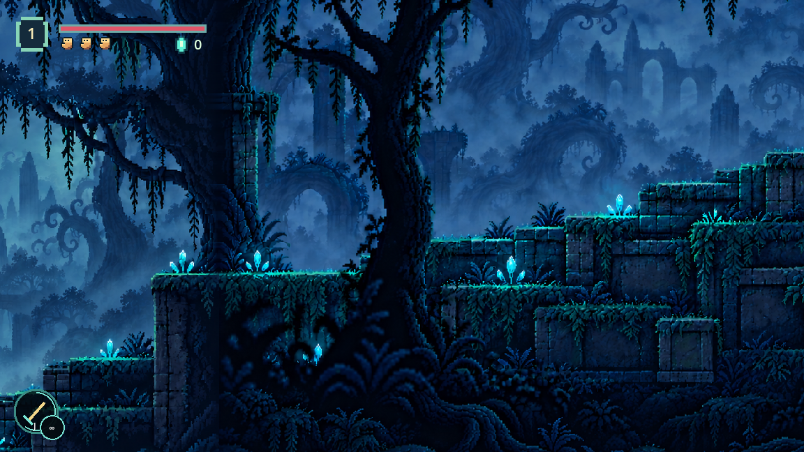

### Left shelf: exact blocked lower approach

The pictured obstruction beneath the left shelf was its separate rectangular
collider, not the previously corrected upper threshold or central pillar. A live
`test_move` at player (2794.39,238.43) identified its right edge at world x2780.383.
The shelf now preserves its cap at source y603 and traces the narrowing stone side
to source x475 at the lower floor y752. Roots in the recessed approach are scenery.
Player dimensions and movement are unchanged.

Full-body shape queries and strict leftward input now enter the formerly blocked
pocket; the running controller reaches (2775.372,238.3665), then walks back out.
Nearby shelf/threshold jumps and central pillar approaches pass in the running game.
Full headless room traversal both ways, Room 2 return and checkpoint persistence
also pass. The test requires entry past the old boundary rather than accepting the
normal route's generous arrival tolerance. Each shelf is checked separately.

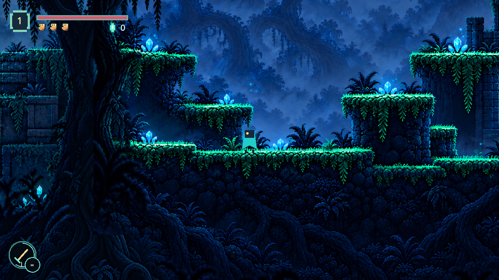

### Hanging plant beneath the upper terrace

The upper terrace's broad support started at source x1200 and extended down to
y590, giving the hanging roots collision. Only its actual narrow masonry pier at
x1320..1370 now extends below the cap; the cap at y425..480 remains solid.
Rendering and physics use the same revised terrain polygon. Roots stay background
scenery. Player movement and dimensions are unchanged.

Full-body queries at source (1210,530) and (1280,530) are clear. An actual jump
from the return tread passes through the foliage height and reverses through it;
the running-game clearance driver passes this check along with the prior pockets
and shelf jumps. Full headless traversal, both doorway directions and checkpoint
persistence pass. The return route lands on the tread's outer half at (1190,676)
before climbing the pillar, preserving that route with the new headroom.
The running-game full route also passes both directions. Direct collision probes
confirm the root space is empty while the cap and actual masonry pier remain solid.

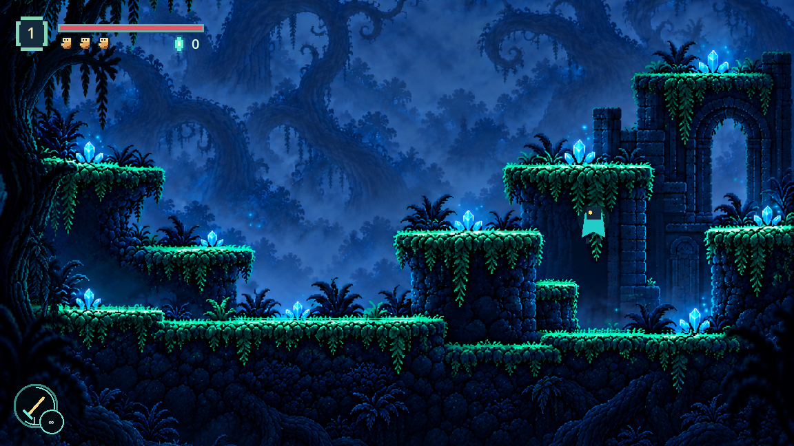

## Asset provenance

Built-in imagegen was used for these whole-painting edits. Saved assets:

- `assets/forest_room1_section1_sky.png` (1320x1191)
- `assets/forest_room1_section2_sky.png` (1303x1207)
- `assets/forest_room1_section3_sky.png` (1315x1197)

Generated dimensions and margins differed from requested dimensions. The renderer registers actual landmark positions instead of assuming the prompt was obeyed. Original source images and the previous foundations remain intact.

### Section 1

Use case: precise-object-edit / upward canvas extension. Edit target is the supplied forest environment plate. Treat its current full image as a logical 1672x1203 canvas. Extend canvas UPWARD by exactly 600 logical pixels to 1672x1803. The entire existing painting stays at x0,y600 with unchanged proportions, platform geometry, detail, colours and lighting. Paint only the new upper area and its precisely connected natural tree/sky continuation. Continue near trunks and canopy upward into treetops, quieter foliage, blue sky and clouds, with matching pixel art, bark direction and depth. Preserve original terrain, crystals, roots and architecture exactly. No characters, UI, text, new platforms, reflected/flipped/repeated imagery, crossfade bands, blur or double branches. No horizontal join or compositional reset: produce one coherent painting. No resizing or recentering the original composition within the logical canvas.

### Section 2

Use case: precise-object-edit / upward canvas extension. Edit target is the supplied forest environment plate. Treat its current full image as a logical 1672x1203 canvas. Extend canvas UPWARD by exactly 600 logical pixels to 1672x1803. The entire existing painting stays at x0,y600 with unchanged proportions, platform geometry, detail, colours and lighting. Paint only the new upper area and its precisely connected natural tree/sky continuation. Continue near trunks and canopy upward into treetops, quieter foliage, blue sky and clouds, with matching pixel art, bark direction and depth. Preserve original terrain, crystals, roots and architecture exactly. No characters, UI, text, new platforms, reflected/flipped/repeated imagery, crossfade bands, blur or double branches. No horizontal join or compositional reset: produce one coherent painting. No resizing or recentering the original composition within the logical canvas.

### Section 3

Use case: precise-object-edit / upward canvas extension. Edit target is the supplied forest environment plate. Treat its current full image as a logical 1672x1273 canvas. Extend canvas UPWARD by exactly 600 logical pixels to 1672x1873. The entire existing painting stays at x0,y600 with unchanged proportions, platform geometry, detail, colours and lighting. Paint only the new upper area and its precisely connected natural tree/sky continuation. Continue near trunks and canopy upward into treetops, quieter foliage, blue sky and clouds, with matching pixel art, bark direction and depth. Preserve original terrain, crystals, roots and architecture exactly. No characters, UI, text, new platforms, reflected/flipped/repeated imagery, crossfade bands, blur or double branches. No horizontal join or compositional reset: produce one coherent painting. No resizing or recentering the original composition within the logical canvas.
