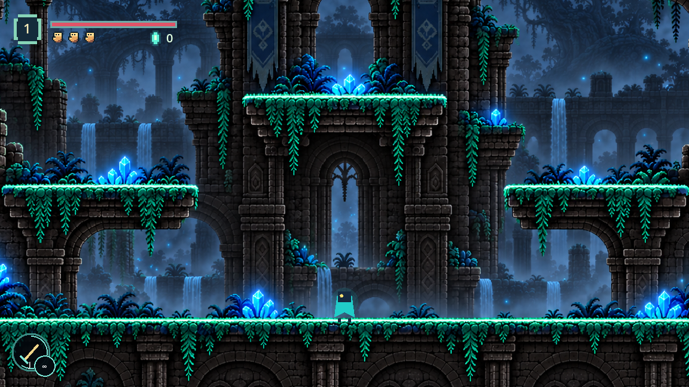
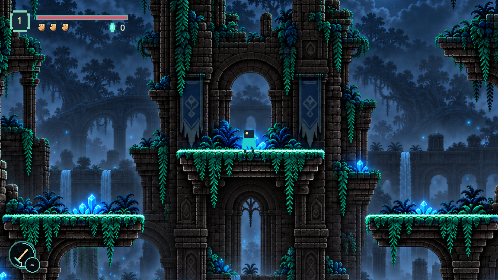
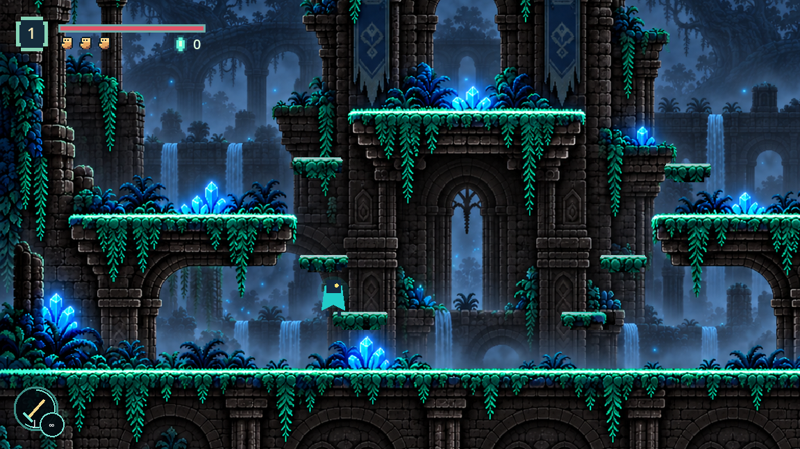
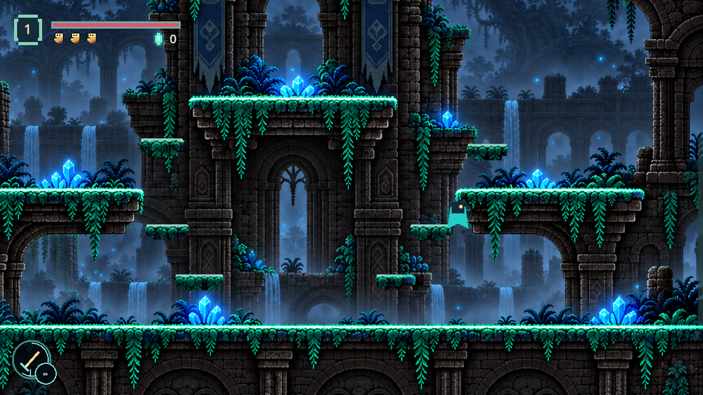

# Forest Room 2, Section 1

The supplied image becomes the section's ruined-gallery composition: a continuous
ground walkway beneath moss-capped balconies, banners and waterfall arches. The
ground route and existing x3600..5000 room bounds/doorway heights remain intact.
Plants, arches, piers and crystals stay behind the live player. The ground, painted
balcony caps, two smaller painted ledges, and six added masonry brackets receive
registered collision; hanging plants and recessed arch openings remain passable.

The side balconies now have short, measured climbs beside their outer edges. Each
uses two lower brackets, the side cap, a tower bracket, then a painted small ledge
to reach the central cap. The upper path returns by walking off the central cap's
east end, through the right arch, onto the side balcony and back to the floor. The
dark ruin crests and canopy high above are recessed background, not marked landings.
No reward, gate or movement change was added.

## Registration and verification

Native painting 1307x1203, world scale1400/1307, floor y831 mapped to world y600.
Origin (3600,-290.1301). Native cap tops y613,467,613 are traced with stepped
undersides instead of broad rectangles through foliage. Camera zoom0.96, zero offset,
top=-290, bottom720. One complete world-space painting covers every tested viewport.
The added brackets sample varied masonry and moss from the supplied painting and use
the same irregular polygons for visible art and collision. Their lower undersides
leave full player clearance above the ground corridor.

Headless `forest_gallery_smoke.gd` passes ground traversal both ways, Room 3 exit and
return, full-body arch/plant clearances, real jumps along both complete ground-to-center
chains, return to ground, balcony support/jumps, artwork coverage, and cave checkpoint
persistence. The running-game driver also completes both full climbs and returns;
its highest-cap jump rises104.17px with86.76px upward camera follow. The usual certificate-store warning and
occasional shutdown resource warning are unrelated to the room checks.

## Assets and exact prompt

Built-in imagegen, through the [imagegen skill](C:/Users/Aiden/.codex/skills/.system/imagegen/SKILL.md),
created the character-free extended painting. The original reference remains intact:

- `assets/forest_room2_section1_reference.png`
- `assets/forest_room2_section1.png`

Generated output was copied from the default Codex generated-images directory into
the root project. Actual padding differs from the requested margins; architecture,
cap and ground landmarks were inspected and registered from the resulting pixels.

> Use case: precise-object-edit. Asset type: pixel-art side-scrolling game environment. Edit the attached Forest Room 2 Section 1 painting. Remove ONLY the small teal character standing on the bottom walkway near x233,y725 and restore the scenery behind it. Preserve the supplied composition and every architecture/platform, crystal, moss, waterfall, plant, colour, lighting and pixel-art detail. Also extend the canvas naturally UPWARD by 400 source pixels and DOWNWARD by 200 source pixels: original logical 1672x941 painting remains unchanged at x0,y400 in a logical 1672x1541 complete painting. Continue the ruined central tower and side masonry into plausible upper broken stone/canopy/sky; continue lower ruin foundations downward. Keep existing walkway at original source y760, side moss balconies y480, central moss balcony y293. Preserve these landmark coordinates/proportions exactly. No other painted characters or live game objects, no HUD/text, no new playable platforms, no mirrored/flipped/repeated painting, no horizontal splice/crossfade/blur/ghost branch or duplicate edges. One coherent crisp pixel-art painting. Do not crop or reposition original architecture.
