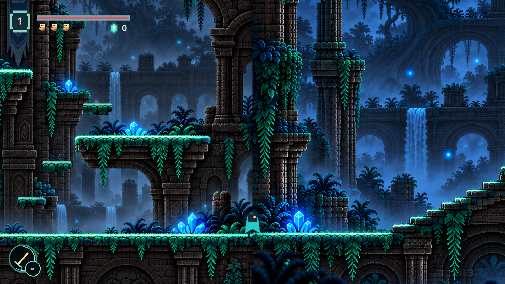
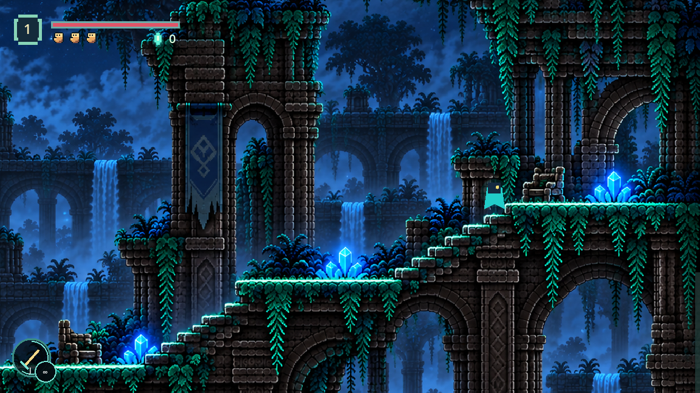
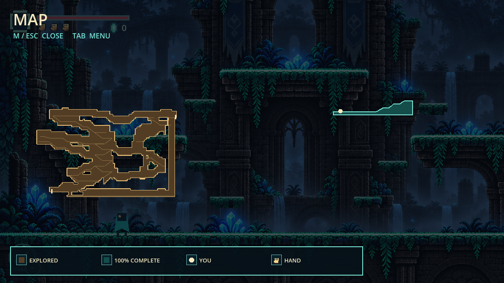

# Forest Room 2, Section 2

Current connection update: Section 3 now continues from x6800 on the same crest
elevation. Room 3 starts at x7800 and returns to Section 3's upper gallery. Sections
2/3 use one connected recessed background, with registered terrain drawn separately;
Room 2 camera top is now-620. See [Section 3 review](forest-room2-section3.md).
The original Section 2 implementation and asset provenance below remain recorded.

The approved second section continues Section 1 at x5000 without changing rooms.
Only the lower floor and ascending masonry stair can carry the player. The two
broad rests are continuous parts of that stair; there are no independent platforms
or a route beneath it. The arches, pillars, crystals, hanging plants and upper ruin
fragments are background scenery. The image's character was removed so only the
live player appears.

The edited character-free painting is `assets/forest_room2_section2.png`; the
user's original remains `assets/forest_room2_section2_reference.png`. Generated
art measured1672x941. Registered x5000..6800, top world y-290 and left floor y600.
The painted landings actually lie at native y795,655,521,404, so all collision and
camera bounds use those measured pixels rather than requested edit coordinates.
The single solid polygon follows the upper floor/stair contour and fills the space
beneath it. No collision is assigned to the visibly recessed ledges or arches.

The Section 1/2 ground caps align at world y600, and one camera envelope spans both
paintings. The Room 3 boundary moves to x6800; its established ground floor receives
after the usual room fade, and the return appears on the stair crest. Room 3 and
Room 4 content moved east by1800px. The map now shows Room 2's rising route.

`forest_stair_smoke.gd` passes real-controller ascent and descent across the seam,
full jumps at the seam and high crest with painted viewport coverage, solid queries
in the under-stair arches, both Room 3 doorway directions, and checkpoint
persistence. `forest_gallery_smoke.gd`, `forest_arrival_smoke.gd`,
`forest_regression_smoke.gd`, and `twisted_forest_smoke.gd` pass with the expanded
room. The running-game `forest_stair_visual.gd` driver also walks the full ascent
and return without a teleport or section transition. Screenshots show the joined
floor, upper stair and updated map at gameplay scale.

The built-in imagegen tool, under the [imagegen skill](C:/Users/Aiden/.codex/skills/.system/imagegen/SKILL.md),
edited the supplied painting. Final prompt:

> Precise edit of provided pixel-art ruined forest stair image. Remove the tiny cyan player at bottom left. Keep the stair, landings, stone, crystals, waterfalls, and composition registered; extend original scene upward into arch crowns, treetops, night sky, and downward into foundations and mist. No new platforms or routes; only stairs are usable. No text, no character, no mirror or repetition.

The generated painting was copied from the default Codex generated-images folder
into the root project. It changed some local vertical proportions, so the
implementation measured the delivered art instead of treating prompt coordinates
as exact. No asset was mirrored, tiled or blended across the join.
