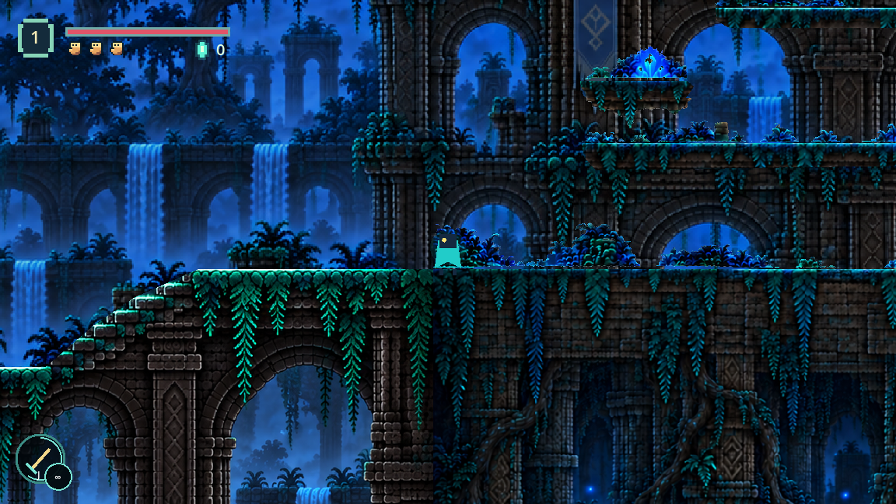
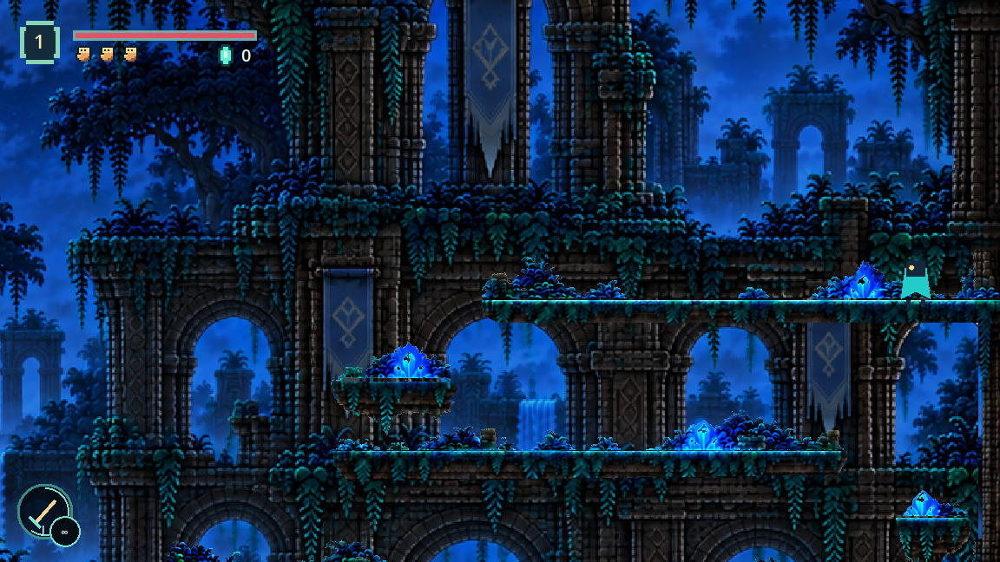
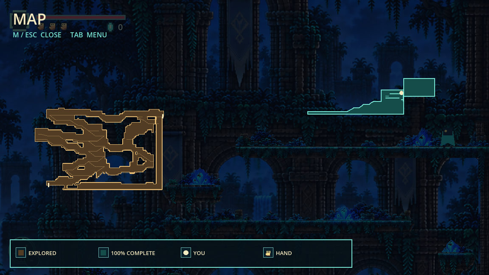

# Forest Room 2, Section 3

Approved lower-left entrance, upper-right exit, four ledges and floor only; right wall sealed beneath the exit. Section 3 spans x6800..7800 in the same Room 2 (x3600..7800). Section 2's crest and Section 3's entrance floor align at y162.202. The highest cap is y-188.122. No new stepping stones, movement changes, enemies or rewards.

Continuous real-controller tests and the live slot0 driver passed all four ledges, the blocked lower wall, full upper jump and camera follow, exit to Room 3 and return to Section 2. The lowest shelf needed a shorter left end because the middle gallery clipped the jump from its old approach. Headroom and horizontal body clearance matter as well as the height gap.

Final assets: `assets/forest_room2_section3.png` (registered stone texture), `assets/forest_room2_section3_props.png` (decorative extraction), `assets/forest_room2_connected_background.png` (one continuous recessed composition). The extraction is RGB with a neutral matte; `forest_prop_cutout.gdshader` removes that matte in the game. Only decorative regions consume it; terrain uses the original measured source and shared rendering/collision polygons. `assets/forest_room2_section2_extended.png` is retained as an intermediate composition reference. The annotated original is `assets/forest_room2_section3_reference.png`.

The built-in imagegen tool was used under [imagegen skill](C:/Users/Aiden/.codex/skills/.system/imagegen/SKILL.md). Exact prompts follow. Generated files were copied from the default Codex generated-images folder into the root project. Failed previews were not used as terrain or transparent sprites.

Validation: `forest_upper_gallery_smoke`, `forest_gallery_smoke`, `forest_stair_smoke`, `forest_arrival_smoke`, `forest_regression_smoke`, `twisted_forest_smoke`; live `forest_upper_gallery_route` metadata `complete=true`, no failure. Tests use isolated saves; live review uses inactive slot0. The Windows test runner also emits existing certificate/log-write and occasional shutdown resource messages; all named PASS markers were checked.

## Initial cleanup and composition

Use case: precise-object-edit. Edit target: the supplied annotated Forest Room 2 Section 3 painting. Produce a complete character-free game environment plate. Remove every red line, blue line, yellow arrow and the small teal character, restoring their covered art. Preserve this scene's forest ruin architecture, banner tower, waterfalls, blue atmospheric depth, masonry and turquoise moss. Preserve EXACTLY FOUR playable moss-capped ledges in their current horizontal arrangement: long upper gallery from about x650 to the right edge, small left ledge x332..564, long middle gallery x318..1355, small right ledge x1340..1610. Preserve the continuous lower floor and right masonry wall below the upper gallery; an open exit leads right above the highest gallery and a lower-left opening leads into the floor. All pillars, arches, plants, banners and other architecture are recessed background. No added platforms, stairs or stepping stones. Make the vertical gaps between consecutive four ledges and floor slightly smaller, approximately 115 source pixels each, to permit game jumps while retaining the same clear alternating gallery composition and full stone undersides. EXTEND THE COMPLETE CANVAS ABOVE AND BELOW with new connected upper ruin tower, canopy, tree crowns and quiet clouded sky above, and masonry foundations below, so the resulting complete scene has generous upper margin above the highest gallery and lower margin below the floor. Target canvas about1672x1600 with main floor y1150, right small top1035, middle top920, left small top805, upper top690. Do not stretch or squash objects. One coherent painting, crisp pixel art, no mirrored/flipped/repeated image, no rectangular bands, no horizontal fades, no ghosted branches, no foreground player occluders, no text/UI/characters/annotations.

## Lower foundations

Use case: precise-object-edit. Input is the complete edited Forest Room 2 Section 3 game painting. Preserve ALL EXISTING PIXELS and the exact four main moss-capped ledges, their heights, widths and positions, floor, right wall and all architecture. Outpaint ONLY downwards: add roughly500pixels of connected ruin foundations and roots below the current bottom without scaling or repositioning the existing composition. The new canvas should be portrait1280x1728. Continue each foundation column naturally into substantial masonry, deep roots and dark ground, no repeated image, reflection, horizontal blending stripe or artificial splice. No new platforms, characters, annotations or text. Keep upper part unchanged.

## Section 2 upper extension reference

Use case: precise-object-edit. Edit target: Forest Room 2 Section 2 stair painting. Extend ONLY ABOVE the existing composition, adding about400sourcepixels of naturally connected upper ruin towers, tree crowns, canopy and quiet clouded night sky. Target canvas1672x1344. Preserve exact existing lower staircase, its four broad landings, ALL floor/support contours, ruin pillars, banners, roots, lighting and composition unchanged; do not change their relative pixel positions or proportions within the original plate. The entire original scene occupies the bottom941pixels; new scenery above it must connect precisely with each existing trunk, column and arch. No mirror, repetition, reflection, horizontal blend strip, ghost branches or UI/characters/text. No new playable platforms. Single coherent sharp pixel-art painting.

## First takeoff correction

Use case: precise-object-edit. Edit target is the supplied complete Forest Room 2 Section 3 portrait game painting,1079x1457. Change ONLY the lowest small moss-capped shelf on the RIGHT at approximately x849..1037,y750: move its LEFT edge inward to x930 while keeping its RIGHT edge and top height exactly fixed. It becomes a shorter shelf x930..1037,y750..783. Remove its former left end and restore quiet recessed background behind that removed portion. Keep all hanging vines nonblocking visually. This creates open air between the long middle gallery's right end at x881 and this shelf's new left edge at x930, allowing a full-body jump from the floor beside the shelf rather than hitting an overhead gallery. Keep ALL other pixels, the image dimensions1079x1457, four platforms total, topgalleryy468,leftshelfy574,middley664,floory846,rightwallx1051 and their positions unchanged. No added platforms, no new objects, no annotations, characters or text.

## Final takeoff correction

Edit ONLY the lowest small right-hand balcony. It is still too long to allow the game's character to jump beside it. Make this balcony MUCH SHORTER: cut away its entire LEFT HALF, so its moss-capped usable top runs ONLY from x960 to x1037 at y750 in this1079x1457 image. Its width must be77pixels, less than half of its current width. Preserve the right end, top height, four balconies total, floor, right wall and ALL other pixels unchanged. Restore recessed waterfall/ruin background in the removed left half. Do not create any new ledges, stairs or solid roots. This must leave a visibly generous open-air takeoff gap between the long middle gallery's right end at x881 and the short lowest right shelf at x960. No text or annotations.

## Continuous scenery

Use case: compositing. These two images are adjoining sections of ONE continuous forest ruin room. Produce ONE coherent BACKGROUND ONLY painting joining the architecture and distant forest without a visible vertical seam. Reference1 is the ascending ruined aqueduct on the LEFT, covering about64percent of the canvas width. Reference2 is the bannered multilevel gallery on the RIGHT covering36percent. Wide landscape canvas about2800x1490. Reference1 lower-left floor lies about86percent down the canvas and ascends to a crest about57percent down at the join; Reference2 lower entrance floor aligns with that crest at57percent down. Its four galleries rise above that floor to about34percent down. KEEP recognizable ruin arches, weathered banner tower, cyan distant waterfalls, moss and layered blue forest from the references, but connect the upper canopy and lower foundation architecture naturally across the join. Crucial: this is the recessed scenery layer. The playable stair, four moss-capped horizontal ledges, floor and right wall will be drawn separately by the game at exact registered positions. Omit those bright usable floor and platform caps from this background; leave quiet blue depth and recessed structural arches behind their expected positions. No additional bright horizontal ledges or apparent stepping stones anywhere. No near foreground occluders. Continuous naturally composed sky and tree crowns above, connected ruin foundations below. No mirroring, reflection, tiling, repeated whole panels, crossfade strips, rectangular joins, player, text, UI or annotations. Crisp pixel art, match reference materials and lighting.

## Decorative extraction (initial discarded preview)

Use case: background-extraction. Extract the playable terrain and its attached decorative plants from this1079x1457 pixel-art painting into a TRUE TRANSPARENT PNG of EXACTLY THE SAME SIZE and registration. Preserve all retained pixels in place. Keep ONLY: the upper long moss-capped gallery at x408..1079,y468..511; the small left shelf x212..377,y574..607; the middle long gallery x215..881,y664..703; the lowest small right shelf x944..1044,y750..799; their attached ferns, crystals and hanging moss/vines; the floor at y846 and the entire masonry foundations below it; and the narrow right wall x1051..1079 from y468 to846. Remove ALL sky, all distant ruins, arch piers/background structural supports between those four shelves, trees, waterfalls, banners and other scenery ABOVE THE FLOOR, leaving real transparency around and under each shelf and behind its plants. Keep each shelf's top crystal/fern silhouettes and hanging moss with precisely cut transparent edges; never retain rectangular patches of blue background. No added objects, no relocation, no new platforms. This is a registered terrain/prop layer for a game; character will draw in front of all these non-foreground decorations. True alpha background, not checkerboard paint.

## Decorative extraction consumed with matte-removal shader

Create a genuinely TRANSPARENT RGBA PNG cutout from this original painting, not a picture of transparency. Output must contain an alpha channel, with alpha0 for removed pixels. NEVER draw a checkerboard. Keep exact original1079x1457 canvas and retained object positions. Extract only four moss-capped stone shelves, with their attached crystals, ferns and dangling vines; the lower floor and masonry below it; and right wall. The four shelf TOPS MUST REMAIN AT EXACT y468,y574,y664,y750; floor y846. Their x positions are respectively408..1079,212..377,215..881,944..1044. Do not move any shelf. Keep each stone's opaque colors and precisely cut leafy silhouettes unchanged. Everything else above floor—including background arches, pillars, sky, clouds, forest, waterfalls and banners—must become fully TRANSPARENT with alpha0. True transparent-background game terrain layer. No checkerboard, white backdrop, gray pattern, new details, repositioning or scaling. Preserve source pixels and registration.

