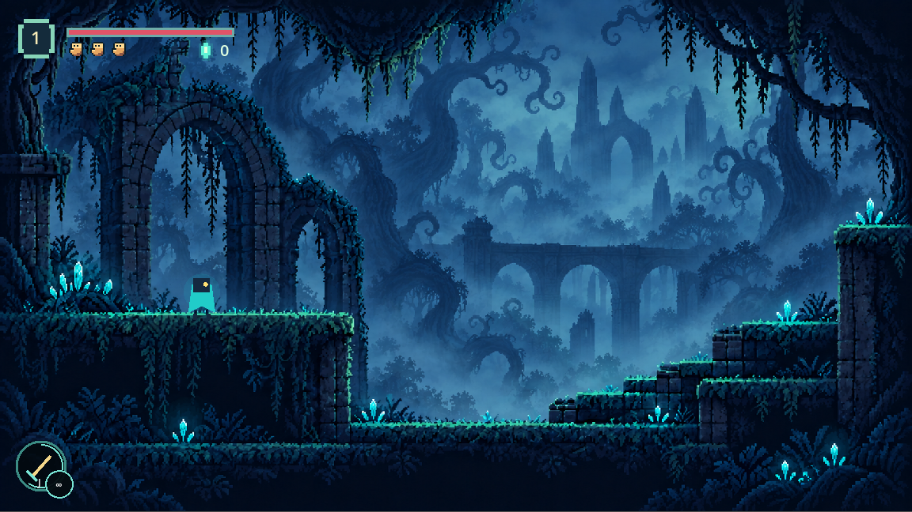
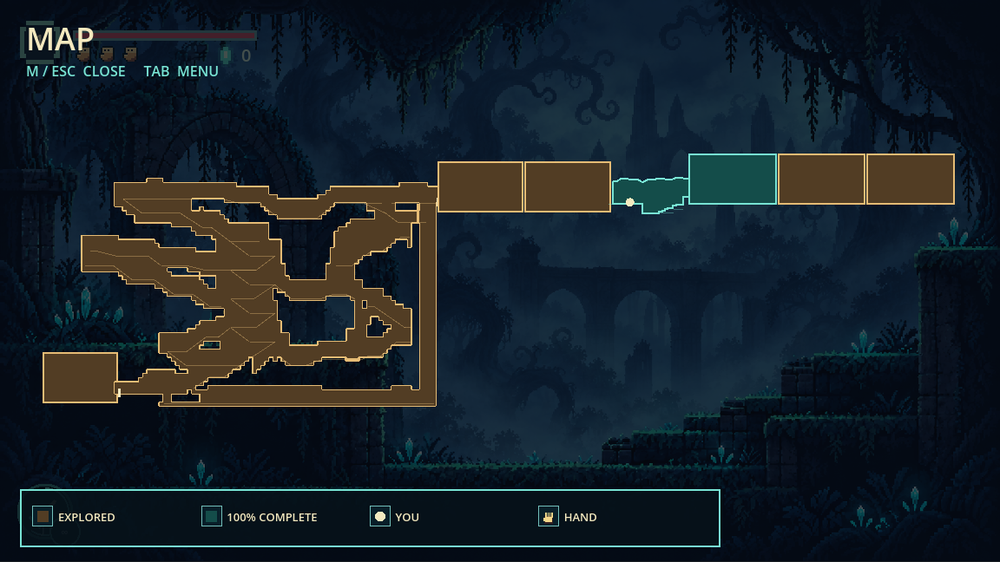

# Forest Room 1 — Section 1

This is the original Section 1 review. The current two-section Room 1 baseline is
in [the connected-room review](forest-room1-connected.md).

The user's supplied image directs this section's composition and materials: dark root
framing, vine-covered masonry, blue mist and layered trees, distant ruins, cyan crystals,
a raised left terrace, lower basin and ascending right-hand steps. The existing flat
first forest room is replaced by those visible surfaces; its original 1200px section width is retained inside the enlarged 2400px room. Source pixels and all playable geometry share the
1200/1672 transform at world origin (0,-40).

The live traveller occupies the scene; the painted duplicate has been removed. Crisp
moss edges follow actual collision. Architectural arches, thin vines and the distant
bridge are scenery. The artwork remains fixed in world space so no parallax movement
can detach painted terrain from collision. The camera frames the whole section.

The map uses the actual arrival chamber silhouette, omits the inaccessible shaded
grotto, and aligns both differing doorway elevations. The section remains a quiet
arrival; no new encounter, collectible or ability was introduced.

Verified with real controller input:

- Raised terrace -> basin -> every stair -> upper-right exit.
- Physical transition into Forest Room 2 and safe return to the raised receiving ledge.
- Reverse stairs and the approximately 146px ledge climb back to the arrival terrace.
- Physical forest-to-cave exit; activated hand checkpoint and gallery flags preserved.
- Existing forest death/transition, bow boss, hand and persistence regression tests.
- Normal running-game traversal in both directions, plus gameplay-scale art/map review.

All four tests emitted PASS: `forest_arrival_smoke.gd`, `forest_regression_smoke.gd`,
`twisted_forest_smoke.gd` and real-time `cave_rooms_smoke.gd`. The visual driver completed both routes without failure.
Review used active save slot0; test saves use isolated roots.

## Asset and exact edit prompt

Final project asset: `assets/forest_room1_section1.png` (1672x941).
Mode: built-in imagegen, supplied image as edit target. The original user file remains
untouched at `C:/NCAT/metroid/forest room 1/forest room 1 section 1.png`.

> Edit the supplied image into production artwork for this same game's Forest Room 1 Section 1. Preserve the exact landscape composition, pixel art detail, dark navy framing roots, layered blue mist, winding trees, distant ruined bridge and cathedral silhouettes, moss, cyan crystal clusters, left raised arrival terrace, lower central basin, right ascending stone terraces and upper-right ledge. Remove ONLY the teal player character standing on the left terrace and seamlessly restore the foliage/background behind it. No replacement character, no HUD, no text, no UI. Preserve all usable terrain top edges, their positions, heights and shapes exactly; do not add, move or delete platforms. Keep the original very wide landscape aspect ratio and match original resolution 1672x941 if supported. Crisp nearest-neighbor pixel-art appearance. The result is a static world-space artwork plate; precise collision will be authored to follow its visible surfaces.
