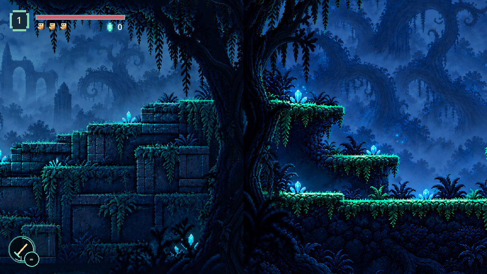
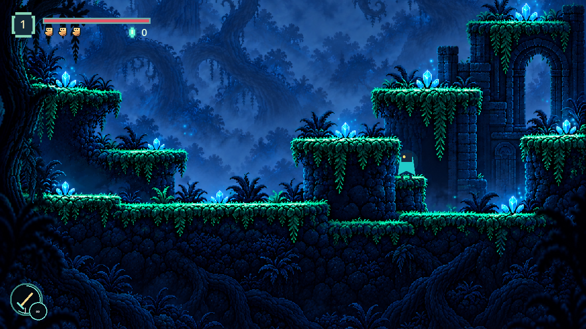
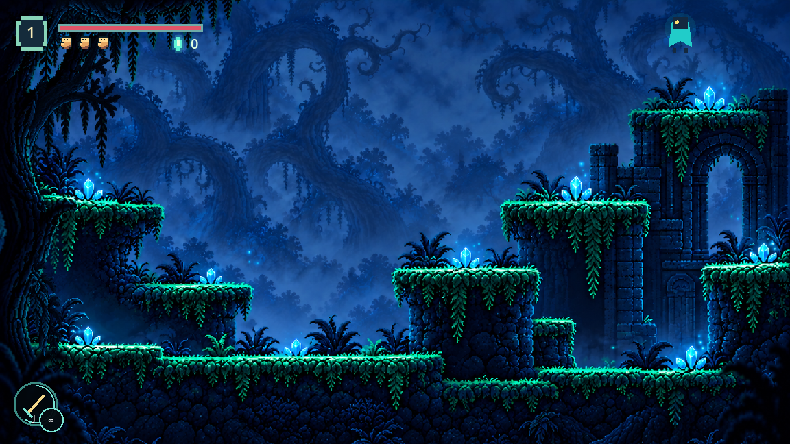
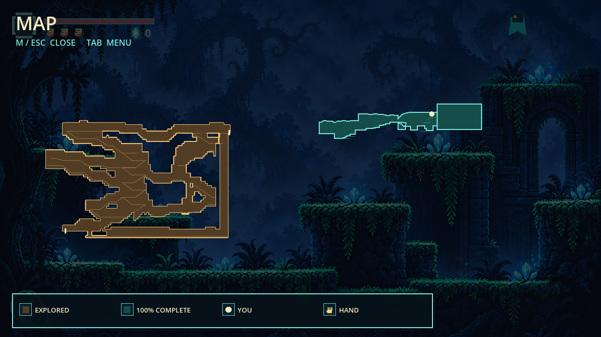

# Forest Room 1: three continuous sections

Later user-reviewed camera, foreground and decorative-collision corrections are recorded in [Forest Room 1 defects](forest-room1-defects.md).

Section 3 extends Forest Room 1 to x0..3600. The art joins at x1200 and x2400 keep the same room ID, controller and scrolling camera. Room 2 begins at x3600; subsequent rooms move together by 1200 px while preserving their local layouts.

## Terrain and presentation

The supplied third composition remains the basis of the clearing, terraces, crystals and ruined arch. The painted character was removed so only the live player appears. Collision follows supported platform masses, including the shallow entrance slope. A small attached stone tread beside the central pillar makes the descent reversible with the measured jump. The generated tread actually lands near source y676, so collision follows that painted cap rather than the prompt's requested y700.

Near trees and hanging roots render over terrain and the passing player. One transparent, opaque-barked foreground trunk joins the two entrance trees into a continuous threshold; there is no crossfade at this seam. The generated foundation extends downward with authored roots and stone. The upper camera envelope exposes existing scenery, with enough coverage for the arch jump.

## Verification

Passed the actual controller route outward and back across all three sections, the Room 2 exit and return, and the cave return. Both art seams preserve the room and camera. Headless checks passed: forest arrival, forest regression, twisted forest and cave rooms. The same continuous arrival route passed in the running game with no failure. Rendered foreground comparisons passed at the original crossings, third-section tree, hanging roots and new shared trunk.

Screenshots above were captured from the running game at gameplay scale. The arch shot places the player at the normal jump apex to inspect the camera boundary. Review used inactive save slot 0; the player's saved slots were not used. Existing checkpoints and rewards remain authoritative.

## Generated assets

Built-in imagegen edits were used; originals remain unchanged.

- `assets/forest_room1_section3_extended.png`: native 1439x1093, registered to a logical 1672x1273 canvas.
- `assets/forest_room1_section3_threshold.png`: native 795x1978 RGBA, registered to a logical 512x1273 foreground canvas. Opaque bark alpha is normalized in the foreground shader; genuine cutout transparency remains outside the silhouette.

The initial edit removed only the baked character from the supplied image, retaining its terrain and scenery. The final production prompts follow.

### Section 3 foundation and return tread

Use case: precise-object-edit. Input image is EDIT TARGET, a character-free 1672x941 forest room section. Make one production environment plate on a 1672x1273 canvas: keep the original at x0,y0, and paint a NEW 332px bottom band continuing its dark rock foundations, roots and sparse shadowed ferns downward naturally. Never flip, mirror, reflect, repeat, recenter or resize the original scene. Preserve every existing platform contour, large trunk, arch, crystal, lighting, blue mist and palette. The ONLY local terrain change: at the RIGHT foot of the central pillar, add a SMALL attached moss-capped masonry foothold. Its top runs from original x1130 to x1200 at y700, with dark stone supporting it down to the existing floor y807. It meets the central pillar's right side and makes a physical return stair, not a floating platform. Thin moss cap has the same pixel art as existing ledges. Do not change the pillar's top at y569 or the next terrace at y425. No character, text, HUD or new bright crystal. No transparency or crossfade band. The rest of the supplied composition remains unchanged.

### Shared threshold cutout

Use case: background-extraction / game foreground sprite. Input images are STYLE and MATERIAL REFERENCES for the near-tree threshold between two sections of our forest room. Generate one SINGLE coherent dark foreground trunk/root cutout on a truly transparent RGBA background. Requested canvas 512x1273. Full-height organic navy/slate-blue bark silhouette at the center, one gnarled near tree, continuous opaque central trunk roughly x175..335 from the top all the way to the bottom. Branches at the top lean outward to connect to the existing framing canopy; lower roots sweep outward into sparse dark fern silhouettes. Pixel-art detail, same near-black bark and cool subtle highlights as reference foreground trees, crisp pixels. This cutout goes IN FRONT of the floor AND the walking player, and provides a naturally shaped shared threshold. No stone floors, platforms, moss cap, crystals, sky, distant architecture, characters, glow, labels or UI. No rectangular fill, gradients, blur or crossfade. True transparent background around the actual irregular silhouette; no baked checkerboard. Tree must read as one continuous near silhouette with matching bark material throughout.
