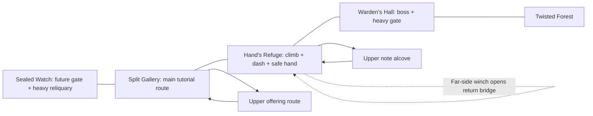

# Room design memory

Established 2026-09-25. Applies to existing and future cave and forest rooms.
This is project memory and an implementation guide; root `AGENTS.md` directs future
room work here. Revise measurements when the player controller changes.

## Intent and references

Rooms should feel like places the player learns, chooses routes through, and later
understands differently. Keep this game's teal traveller, hand chairs, Heartroot
history, pixel art, and inherited Wills as its own identity.

Reference research used the developers' own material:

- [Team Cherry's Forgotten Crossroads tour](https://www.teamcherry.com.au/blog/the-forgotten-crossroads-a-hollow-knight-tour)
  describes damaged roads, interconnected tunnels, shortcuts and treasure. Our design
  takeaway is to make exploration produce useful route knowledge and easier returns.
- [Ori and the Will of the Wisps](https://www.orithegame.com/) foregrounds crafted
  platforming, painted environments and emotional storytelling. Our visual and spatial
  interpretation is to compose movement in readable arcs, use layered depth, and let
  light lead to something the player can actually reach.
- [ENDER LILIES' official overview](https://en.enderlilies.com/) connects ruined places,
  powerful foes and exploration abilities. Our interpretation is to give each chamber
  a remembered purpose, place quiet space around danger, and show reasons to revisit.

These are high-level design interpretations, not claims that the references use our
specific dimensions or rules. Do not reproduce their maps, characters, landmarks,
palettes wholesale, interface treatments, or extracted art.

## What the original caves were missing

Inspection covered `tutorial_world.gd`, the player controller, existing gameplay tests,
and the running cave scene. The backdrops already supply attractive atmosphere and
the tutorial already teaches working mechanics. The weak point was room composition:

| Observation | Consequence | Applied response |
| --- | --- | --- |
| Nearly every destination sat along the same floor at y=600 | Movement felt like a sequence of tutorial stations | Added elevated optional routes with rewards and safe rejoins |
| Most upper space was decorative, without collision or enclosure | Rooms felt like open strips in front of images | Added varied, solid, stepped ceilings that share their outlines with collision |
| Similar floors and little foreground identity between rooms | Room numbers were easier to remember than places | Named four chambers and assigned each a dominant landmark and activity |
| No useful change to the return journey | Backtracking repeated the same traversal | Added a bridge operated from the far side of the chasm |
| Room 1 was almost entirely a dead end | Little reason to investigate or return | Added a visible reliquary opened with the later heavy attack |
| Several control labels appeared across the scenery at once | Text competed with rewards, platforms and enemy tells | Show one nearby, relevant prompt in a stable HUD position |
| Bright detail covered much of the terrain | Important edges had weak visual priority | Reduced interior stone noise, kept bright landing edges and recessive scenery |
| The Warden exit wall did not join the ceiling | Its ability gate depended on a short obstacle | Extended the wall to the ceiling and shared its crack motif with the reliquary |

## Shared design rules

1. **Start with a room brief.** Write the purpose, main movement verb, entrance view,
   landmark, optional decision, reward, return path, and failure recovery before
   adding decoration. Every room needs a purpose; a rest room need not contain combat.
2. **Compose an entrance, an activity, and a release.** The entrance gives the player
   stable footing and a readable view. The activity has room to attempt the mechanic.
   The release allows recovery, reward collection, or a view of the next destination.
3. **Make choices that reconnect.** Prefer an optional upper or lower route that drops
   back into known space over an arbitrary dead end. A deliberate dead end needs a
   payoff, lore, a vista, or a clearly signalled future ability gate.
4. **Give returning a benefit.** Open a shortcut from the far side after the first
   successful crossing. A later ability should change at least one earlier place.
   Shortcuts are persistent world state and must also work after reload and biome travel.
5. **Design with the real movement envelope.** Use conservative jumps for the main
   path. Measure reach from actual takeoff and landing edges, including the player's
   width. Distinguish a normal jump, a ledge climb, and a deliberate air-dash test.
   Teleporting to a reward is not proof its route works.
6. **Make collision visually honest.** Bright stone caps mean a surface can support
   the player. Solid ceiling silhouettes collide. Recessed arches, chains, roots and
   pillars use lower contrast and must not resemble foreground barriers. Share one
   geometry definition between drawing and collision whenever possible.
7. **Use negative space deliberately.** Keep the silhouette around the player, enemies,
   jump arcs, landings and interaction points legible. A boss arena gets an uninterrupted
   fighting floor; a rest point gets a safe, spacious approach and dismount location.
8. **Give the eye a hierarchy.** First the player and threat tells, then usable edges
   and rewards, then landmarks, then distant scenery. Use a small warm accent for
   rest and muted cool depth for traversal. Light should lead to meaningful places.
9. **Teach through the room, then assist with text.** Put a safe attempt before a
   demanding use. Show a single concise prompt near its use, hide learned tutorial
   prompts, and keep world lore separate from control instructions.
10. **Use consistent gate language.** Amber cracks identify heavy-attack stone in the
    cave. Ordinary strikes must not grant its reward. A required wall joins terrain so
    it cannot be jumped around. A future sealed exit must not look like an active door.
11. **Preserve spatial and state continuity.** Frame doorways, provide a safe receiving
    area, and update camera limits and smoothing after a teleport. Hand activation,
    room visitation, reward collection and checkpoint selection are separate states.
12. **Make the map tell the truth.** Visiting reveals a room. Completion reflects its
    authored reward objectives, including optional caches. Both biomes must report the
    same completion state for the same cave. Do not mark a future sealed area explored.

## Current movement measurements

From `scripts/player.gd`: speed 255 px/s, jump velocity -500 px/s, gravity 1250 px/s²,
body 28 × 46 px, air dash 780 px/s for 0.23 seconds.

- An unobstructed normal jump rises about **100 px** and takes about **0.8 seconds**
  to return to its starting height. Ideal horizontal reach is about **204 px** before
  acceleration, body clearance and landing margins reduce the usable distance.
- Default optional step rises here are **75–80 px**, with platforms **100–165 px** wide.
  Leave takeoff and landing room; target centers alone are misleading.
- At an 80 px rise, descending arrival is roughly 0.58 seconds after takeoff, so the
  ideal horizontal reach is only about **148 px**, before acceleration. Do not use
  the 204 px same-height figure for an ascending jump.
- A full stationary jump needs roughly **146 px** from floor to ceiling for the body's
  height and jump rise. Use **160–180 px or more** around elevated routes and then
  test the actual stepped roof. Intentional low passages need a different brief.
- The existing **130 px shelf** is a ledge-climb lesson, not a normal jump target.
  The **290 px chasm** remains the intended dash lesson until its return bridge opens.
- Keep room-entry landing zones, the hand at (2610, 546), its dismount at x=2695, and
  the Warden floor free of added obstacles. New optional geometry must not break these.

These are starting constraints, not a substitute for controller-driven playtests.

## The implemented cave rooms

The four-room sequence is still the introductory route. It now contains local forks,
an ability-gated return objective and a persistent shortcut. It is not yet a region
with a large network of inter-room loops; future region expansion should add those.

| Room | Identity and purpose | Route and payoff | Return behavior |
| --- | --- | --- | --- |
| 1: The Sealed Watch | Quiet memorial chamber with a closed outer gate | Three ascending shelves lead to an amber-cracked reliquary; heavy attack grants 25 Will | The reward invites a return after the Warden; the future End Area remains closed |
| 2: The Split Gallery | Traversal and combat beneath suspended stone galleries | Main route retains the jump, sentinel, drop and seal lessons. An upper route climbs from the Sigil shelf, grants 12 Will, and rejoins above the sentinel | Elevated and lower approaches form a local loop; collected rewards stay collected |
| 3: The Hand's Refuge | Cold chasm followed by a warm, sheltered rest | First cross using the existing climb and air dash. Operate the far-side winch; climb a turning route above the hand to the note | The bridge removes the repeated dash across the chasm; the ledge climb remains |
| 4: Warden's Hall | Tall ruined chamber with an open fighting floor | Large recessed arch frames the boss. The ceiling-connected wall teaches the inherited heavy attack; steps and green growth lead toward the forest | The opened wall stays open; the hand remains immediately before the encounter |

Geometry and reward anchors live in `scripts/cave_layout.gd`. `cave_scenery.gd` owns
recessive architecture, light pools and sparse spores. `tutorial_world.gd` owns collision,
interaction, progress and prompts. Do not put game-state changes in scenery drawing.

New save fields are `cave_shortcut_open`, `gallery_cache_found`, and `watch_cache_found`.
Missing fields in old saves default to false. Room 1 completion requires its reliquary;
Room 2 requires the Sigil and offering; Room 3 requires the note; Room 4 requires the
Warden. The bridge is a utility shortcut, not an additional completion collectible.
Claims and their Will increments save together so leaving a room cannot lose an
in-flight reward. Forest saves preserve these cave fields.

## Carry this baseline into forest rooms

Keep the same room briefs, measured jumps, safe landings, readable collisions, local
loops, useful returns, and persistent state. Adapt the materials and composition:

- Use roots, boughs, hollow trunks and canopy openings to enclose space. Use warmer
  open patches or quiet clearings around hands and cooler, denser growth around danger.
- Keep traversable branches distinct from thin background vines; do not use identical
  silhouettes for solid platforms and scenery.
- Give each room a specific natural or inhabited landmark, not simply more trees.
- Use irregular organic routes while preserving tested reach and camera visibility.
- A bow lesson needs a clear line of sight and a visible target, safe footing to aim,
  and access to an arrow refill. Do not strand progression behind consumable ammo.
- Future multi-room regions should include a connection back to a known room, not
  merely a longer chain of rooms. Reflect added connections in the map.

## Verification and lessons from this pass

`tests/cave_design_smoke.gd` drives the real player through all nine new ascending
connections/return landings, raycasts each roof, checks cache collection and repeat prevention, exercises
the heavy reward, walks across the bridge, and reloads through the forest to verify
persistence. `cave_rooms_smoke.gd` covers the original tutorial, pitfalls, hand, boss,
heavy wall, map and forest transition. Existing forest and save tests cover shared state.

Visual review uses the running game, not just collision diagrams. Check the initial
gallery, the hand/chasm, the sealed Watch and the boss chamber at gameplay scale.
The first review found overly smooth ceiling diagonals and banded light circles:
use stepped rock outlines shared with collision and soft radial light instead.
The stepped-outline pass also exposed a physics failure: duplicate consecutive polygon
points can make Godot's convex decomposition fail while the ceiling still draws.
Remove duplicate points and verify the resulting collider with physics queries; a
successful screenshot or script parse alone cannot prove the ceiling is solid.

Acceptance checklist for future room work:

- Walk the main route both ways and physically reach each new optional reward.
- Check jump arcs against ceilings, platform undersides and enemies.
- Verify optional routes reconnect and the reward cannot be collected twice.
- Verify gates before/after their ability; check for routes around required walls.
- Verify return shortcuts, save/reload, biome round trips, death and hand dismounts.
- Review threat silhouettes, prompt placement and room exits in the running game.
- Update this memory, the room description and map completion rules together.
- Rebuild `docs/` when delivering an updated local web build; publication is separate.

Use isolated test save roots. Do not mutate the player's real save slots to set up a
review. Do not treat a headless visibility flag as proof that something renders well.
