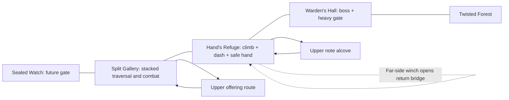

# Room design memory

Established 2026-09-25. Applies to existing and future cave and forest rooms.
This is project memory and an implementation guide; root `AGENTS.md` directs future
room work here. Revise measurements when the player controller changes.

## ART_DESIGN_MEMORY

Read [ART_DESIGN_MEMORY.md](ART_DESIGN_MEMORY.md) alongside this document before
creating or adjusting cave or forest rooms, including room presentation. It extends
the visual honesty, hierarchy, enclosure, background, and intentional-placement rules
below. This document remains authoritative for layout, movement, progression,
persistence, major-change approval, and gameplay verification.

## Intent and references

Rooms should feel like places the player learns, chooses routes through, and later
understands differently. Keep this game's teal traveller, hand chairs, Heartroot
history, pixel art, and inherited Wills as its own identity.

Reference research used the developers' own material:

- [Team Cherry's Forgotten Crossroads tour](https://www.teamcherry.com.au/blog/the-forgotten-crossroads-a-hollow-knight-tour)
  describes damaged roads, interconnected tunnels, shortcuts and treasure. Our design
  takeaway is to make exploration produce useful route knowledge and easier returns.
- [Ori and the Will of the Wisps](https://www.orithegame.com/) foregrounds crafted
  platforming, painted environments and emotional storytelling. Our visual and spatial
  interpretation is to compose movement in readable arcs, use layered depth, and let
  light lead to something the player can actually reach.
- [ENDER LILIES' official overview](https://en.enderlilies.com/) connects ruined places,
  powerful foes and exploration abilities. Our interpretation is to give each chamber
  a remembered purpose, place quiet space around danger, and show reasons to revisit.

These are high-level design interpretations, not claims that the references use our
specific dimensions or rules. Do not reproduce their maps, characters, landmarks,
palettes wholesale, interface treatments, or extracted art.

## Supplied image annotations and room references

The user's circle colors are an explicit gameplay key, not decorative markup:

| Circle color | Meaning |
| --- | --- |
| Blue | Walls |
| Red | Walkable platforms that are not the floor |
| Purple | Drop-through platforms |
| Yellow | Breakable floors or walls |
| White | Interactable entrances |

Apply this key when interpreting supplied room images and layouts. Keep ordinary
floors distinct from red-marked platforms, and do not treat purple platforms as
solid, non-drop-through terrain. Yellow marks identify breakable terrain; determine
the required ability from the room brief rather than assuming every gate uses the
same attack. White marks require entrance interaction, not merely background art.

The user's X marks are an explicit initial enemy spawn key:

| X mark color | Enemy type |
| --- | --- |
| Blue X | Kobold Archer |
| Green X | Goblin |
| Yellow X | Goblin Dog |
| Purple X | Kobold Clubber |
| White X | Kobold Summoner |
| Red X | Goblin Sentinel |

The position of the X is where the initial spawn point is, ensuring actors touch the ground.
Enemies can travel anywhere the player can walk/run (including up/down slopes and across platforms),
except they cannot jump or drop through. Enemies do not have spawn areas they cannot leave,
and never teleport unless explicitly stated as an ability.

Cave Room 2's enemy spawn references are preserved in [references/cave-room2](references/cave-room2/README.md),
copied from `C:\NCAT\metroid\CAve room 2`.
Forest Room 2's supplied appearance and enemy spawn references and full layout are preserved in
[references/forest-room2](references/forest-room2/README.md), copied from
`C:\NCAT\metroid\forest room 2`. Consult `Layout.png` and the appropriate section
images together before planning or implementing a section. Preserve the split
references for Sections 8, 9 and 10. The bugfix screenshot folder is excluded.
These references describe the intended room; copying them does not implement or
approve additional sections beyond the user's authorized work.

## What the original caves were missing

Inspection covered `tutorial_world.gd`, the player controller, existing gameplay tests,
and the running cave scene. The backdrops already supply attractive atmosphere and
the tutorial already teaches working mechanics. The weak point was room composition:

| Observation | Consequence | Applied response |
| --- | --- | --- |
| Nearly every destination sat along the same floor at y=600 | Movement felt like a sequence of tutorial stations | Added elevated optional routes with rewards and safe rejoins |
| Most upper space was decorative, without collision or enclosure | Rooms felt like open strips in front of images | Added varied, solid, stepped ceilings that share their outlines with collision |
| Similar floors and little foreground identity between rooms | Room numbers were easier to remember than places | Named four chambers and assigned each a dominant landmark and activity |
| No useful change to the return journey | Backtracking repeated the same traversal | Added a bridge operated from the far side of the chasm |
| Room 1 was almost entirely a dead end | Little reason to investigate or return | Added a visible reliquary opened with the later heavy attack |
| Several control labels appeared across the scenery at once | Text competed with rewards, platforms and enemy tells | Show one nearby, relevant prompt in a stable HUD position |
| Bright detail covered much of the terrain | Important edges had weak visual priority | Reduced interior stone noise, kept bright landing edges and recessive scenery |
| The Warden exit wall did not join the ceiling | Its ability gate depended on a short obstacle | Extended the wall to the ceiling and shared its crack motif with the reliquary |

## Shared design rules

### Major room changes require a proposal and explicit approval

Before implementing a major room expansion, structural redesign, or connection change,
inspect the current room and read this memory. Give the user a report describing the
existing structure and its problems, expansion directions, named chambers and levels,
branches and reconnecting routes, approximate meaningful playable-space increase,
gameplay-screen dimensions, and what existing elements stay or move. Include a simple
side-view route diagram with entrances, exits, rewards, encounters, loops and shortcuts.
Identify coordinate-dependent tests and explain how their original intent will survive.
Disclose proposed doorway changes and the map, transition and spawn updates they need.
Do not edit files, generate replacement assets, or implement the redesign before explicit
user approval. Once approved, build logical sections and run relevant Godot tests and
controller-driven gameplay checks after each section before proceeding. Existing approval
authorizes that agreed layout; do not repeatedly ask for approval of its routine details.

The latest Split Gallery connection and art revision was explicitly approved on
2026-09-26: Room 1 connects at the lower left, Room 3 at the upper right; the heavy
shortcut accelerates the Room 3-to-1 return, and the future pocket has only its floor
gate as an entrance/exit. The current anchors and verification below supersede earlier
upper-left entrance and central-wall proposals.

1. **Start with a room brief.** Write the purpose, main movement verb, entrance view,
   landmark, optional decision, reward, return path, and failure recovery before
   adding decoration. Every room needs a purpose; a rest room need not contain combat.
2. **Compose an entrance, an activity, and a release.** The entrance gives the player
   stable footing and a readable view. The activity has room to attempt the mechanic.
   The release allows recovery, reward collection, or a view of the next destination.
3. **Make choices that reconnect.** Prefer an optional upper or lower route that drops
   back into known space over an arbitrary dead end. A deliberate dead end needs a
   payoff, lore, a vista, or a clearly signalled future ability gate.
4. **Give returning a benefit.** Open a shortcut from the far side after the first
   successful crossing. A later ability should change at least one earlier place.
   Shortcuts are persistent world state and must also work after reload and biome travel.
5. **Design with the real movement envelope.** Use conservative jumps for the main
   path. Measure reach from actual takeoff and landing edges, including the player's
   width. Distinguish a normal jump, a ledge climb, and a deliberate air-dash test.
   Teleporting to a reward is not proof its route works.
   Every platform that reads as usable must have a continuous route from the room's
   entrance with currently available movement and a safe way back to the main route,
   unless the design explicitly identifies it as a future ability destination or
   nonplayable scenery. Test every link with the real controller, including the
   reverse or drop route; standing on each cap via fixtures proves only collision.
   Check overlapping undersides at the takeoff as well as the nominal height gap.
   Provide a full-body launch pocket outside overhead terrain; a mathematically
   reachable destination can still be inaccessible because the head clips a ceiling.
6. **Make collision visually honest.** Bright stone caps mean a surface can support
   the player. Solid ceiling silhouettes collide. Recessed arches, chains, roots and
   pillars use lower contrast and must not resemble foreground barriers. True near
   foreground is a separate occlusion layer in front of both terrain and entities;
   it hides the floor and passing player without changing the route's collision.
   Never draw support edges through an opaque foreground trunk. Share one geometry
   definition between drawing and collision whenever possible.
   Keep foliage beside takeoff and landing surfaces behind the player. Foreground
   masks must isolate actual near silhouettes rather than covering nearby plants
   needed to read footing. Verify both approach directions and the landing itself.
   Decorative foreground trunks must not conceal accidental barriers from canopy
   or neighboring terrain collision. Check body and jump clearance behind each
   occluder, especially at section joins, in both directions. Keep the route clear
   unless a physical obstacle is deliberately designed and visibly readable.
   Replacing or transforming room artwork invalidates foreground-mask verification.
   Match masks to the current displayed silhouettes and registration, then inspect
   complete crossings both ways, including edge positions, branches and player glow.
   Interior-only mask checks are insufficient: bark omitted from a stale outline can
   let the player render over a foreground tree. This is a defect, never acceptable.
   Terrain collision must match the actual solid silhouette at platform tops, sides,
   undersides and adjoining openings. Do not trace broad enclosing polygons through
   recessed stone, roots, foliage or visibly open space. Inspect every approach with
   the full player body: walking from both sides, jumping beside walls, ledge catches
   and travel beneath overhangs. Passing a centerline route does not validate nearby
   clearance. Invisible footing and scenery that blocks visibly open routes are
   unacceptable; correct the terrain definition rather than shrinking the player
   hitbox or changing movement to accommodate an inaccurate collider.
7. **Use negative space deliberately.** Keep the silhouette around the player, enemies,
   jump arcs, landings and interaction points legible. A boss arena gets an uninterrupted
   fighting floor; a rest point gets a safe, spacious approach and dismount location.
8. **Give the eye a hierarchy.** First the player and threat tells, then usable edges
   and rewards, then landmarks, then distant scenery. Use a small warm accent for
   rest and muted cool depth for traversal. Light should lead to meaningful places.
9. **Teach through the room, then assist with text.** Put a safe attempt before a
   demanding use. Show a single concise prompt near its use, hide learned tutorial
   prompts, and keep world lore separate from control instructions.
10. **Use consistent gate language.** Amber cracks identify heavy-attack stone in the
    cave. Ordinary strikes must not grant its reward. A required wall joins terrain so
    it cannot be jumped around. A future sealed exit must not look like an active door.
11. **Preserve spatial and state continuity.** Frame doorways, provide a safe receiving
    area, and update camera limits and smoothing after a teleport. Hand activation,
    room visitation, reward collection and checkpoint selection are separate states.
    Within one continuous room, do not switch camera limits abruptly at an x threshold
    or artwork seam. Prefer one consistent camera envelope; where limits must vary,
    transition them smoothly without snapping the view or resetting smoothing.
    Provide artwork for every resulting viewport and test crossings in both directions
    while walking and jumping, including reversals near the threshold.
12. **Make the map tell the truth.** Visiting reveals a room. Completion reflects its
    authored reward objectives, including optional caches. Both biomes must report the
    same completion state for the same cave. Do not mark a future sealed area explored.
    Draw side rooms as branches at their actual doorway connections. Persistence IDs
    do not determine a horizontal room order; map framing, hand markers and focused
    views must follow the authored connection graph.

13. **Fully enclose every cave.** Authored playable space must have continuous solid
    outer floor, walls and ceiling with substantial visible rock mass. The player must
    never fall outside the level. Thin floating terrain is reserved for deliberate
    interior platforms. Existing caves use Room 3's solidity and composition as the
    baseline, with a physical basin wherever an old opening would otherwise escape.
14. **Shape connected chambers before platforms.** Give each chamber a physical floor,
    roof, walls and entrances; join them with tunnels and shafts through rock. Use
    neighboring spaces, solid ribs and vertical overlap to explain where routes go.
    A collection of routes in a large background rectangle is not sufficient enclosure.
15. **Use one room-specific background composition.** Large cave rooms need continuous
    artwork corresponding to their chambers and levels. Repeated motifs are allowed;
    visibly tiling copies of the same backdrop are not. Scenery supports real geometry.
    Camera limits should frame a visible band of the solid outer shell; do not crop
    the boundary entirely off-screen. Verify extreme camera corners remain inside rock.
    Set camera coverage from full jumps on every elevated takeoff surface, including
    section thresholds, at the actual viewport and zoom. Do not clamp upward camera
    tracking merely to hide missing artwork. Author the required scenery above first,
    then allow normal tracking through the jump arc. Test this with actual jump input;
    standing views and a manually positioned apex do not prove camera follow works.
    Missing artwork must be authored as a natural continuation, never filled by
    flipping, reflecting or repeating the image. Forest views above an existing plate
    must continue trunks into treetops and sky/clouds, with correct depth and lighting.
    Never hide a mismatched artwork extension under a crossfade or transparency band.
    Use a coherent painting or a precisely connected join and inspect the branch
    silhouettes at gameplay scale across the camera's movement.
16. **The hole mechanic is removed.** Do not reintroduce fall damage, void death,
    out-of-map fall recovery teleports, or their prompts unless explicitly requested.
    The user's earlier word "hold" was a typo for "hole". Ledge catching, hanging,
    climbing, S+Jump dropping, healing and charged attacks remain supported.
17. **Scale encounter design with meaningful space.** Alternate exploration, traversal,
    combat and recovery. Place existing enemies at purposeful chamber thresholds,
    junctions, reward approaches and return routes. Use different combinations and
    elevations; preserve quiet alcoves and landing/entry clearance. Avoid enemies on
    every platform. Test spawn support, patrol bounds and approaches from both sides.
18. **Render connected rock as one continuous mass.** Outer shell, chamber partitions,
    structural floors and slopes must belong to the same material system. Unite their
    silhouettes and texture coordinates; draw exposed edges rather than outlining each
    construction rectangle. Do not leave background slivers, underside gaps, isolated
    contrasting blocks or internal seams between pieces intended to be solid geology.
    A collision-safe room can still fail visually: review floor/slope joints and wall
    junctions at gameplay scale, not just the map or boundary sweep.
19. **Author the purpose of each placement and drop-through surface.** Every object,
    obstacle, parkour sequence and platform must serve a route, encounter, reward,
    landmark or deliberate return connection. Horizontal geometry is not automatically
    drop-through. Structural floors are solid; explicitly mark only deliberate descent
    shelves, name their destination and verify safe landing and return access. Avoid
    tiny accidental pockets beneath shelves and randomly scattered stepping blocks.

### Current approved Split Gallery topology (2026-09-26)

- Room 1 receives into Room 2 at (80,1473), floor y=1500. New games and deaths
  before any hand use Room 1's `CAVE_LAYOUT.START` (-640,577), floor y=600.
  The supplied bloody Room 1 plate and eight-pose wake play once for four seconds
  on a fresh slot. `opening_seen` saves completion; legacy saves, activated hands
  and biome returns bypass the opening. Room 3 receives from the upper-right floor y=-1500;
  returning into Room 2 uses (4920,-1527). Neighbor receiving positions remain
  Room 1 (-80,570) and Room 3 (1780,570). Both map views align these connections.
- Main ascent: Broken Balcony -> foundation approach -> full Chain Well -> offering
  ascent -> Crown Passage -> upper seal vestibule. It works before the heavy ability.
  Memorial, overlook, Drop Bay, undercroft and eastern ascent form optional loops.
- Heavy wall: Rect2(4660,-1500,48,300), between the eastern brow and enclosed service
  shaft. The shaft's continuous west wall prevents intermediate side entries. Its
  basal tunnel returns to the entrance through two measured jumps. Alternating 75px
  footholds permit the reverse climb; the outer lane permits a quick contained descent.
  A real-controller test measured 29.08 seconds versus 65.07 retracing the main ascent,
  with enemies disabled and without dash. This is a route comparison, not a global
  speedrun optimum. `gallery_heavy_open` persists and is not a completion objective.
- Future floor: Rect2(3540,945,240,48). The pocket beneath is enclosed on all other
  sides; no tunnel, door or shortcut connects it. Current attacks and S+Jump cannot
  open it. Downward smash remains unimplemented. Reserved interior steps lead back
  through the same aperture. The pocket is excluded from explored map cells and
  playable-space measurements; it contains no current completion objective.
- Solid rock, slopes and outer shell share one world-space material and exposed-edge
  treatment. Suspended flat shelves explicitly support descent. The overlook and
  eastern winch stairs approach suspended terminal landings; making these caps solid
  would obstruct the ascent from below. Test upper-floor undersides as well as jumps.

The global composition, fourteen irregular work zones, adjacent-zone checks, running
reviews and final evidence are recorded in `design/reviews/split-gallery-plan.md`.
The units are authoring boundaries only; no scene clipping, palette reset or backdrop
tiling marks them. `scripts/gallery_art.gd` owns anchored local scenery behind terrain.

Retained collision lessons: a thin suspended foothold can be intentional interior
architecture; thickening it blindly can obstruct the climb it supports. Geological
backing must preserve the measured headroom of nearby routes AND stair footholds.
A solid upper landing must leave a real sideways approach for a jump/ledge catch.
Test each branch at its joint; otherwise walking can follow the higher intersecting
ramp when the intended destination is the lower route.

Consecutive 75px descents exposed a stale exception: use the actual shelf thickness
(18px footholds versus 32px galleries). An exception may release before its minimum
timer only after landing fully below the old shelf. Separation above or beside it
still waits for the timer, preventing sideways reattachment at switchback joints.
The player controller's gravity, jump, dash, ledge catching and climbing are preserved.

Save data now includes `checkpoint_y`. Old activated cave-hand saves without this
field retain y=570; saves without any activated hand receive at the new start. Forest
saves preserve this field and `gallery_heavy_open`. Both map views in both biomes use
`map_space()` to include geological backing even when opening directly in the forest.

Verification retains the earlier tests' intentions: continuous first visit and return
without heavy attack; every optional gallery both ways with the heavy shortcut opened
for that geometry fixture; real jumps and ledge climbs; boundary/collision matching;
rewards, completion, checkpoints, reload and biome travel; existing-roster combat.
`gallery_joints_smoke.gd` isolates risky climb links using the section test's assertions.
`gallery_gates_smoke.gd` uses actual charged input, tests both doorway directions and
both directions through the opened heavy wall, and verifies solid exit/future floors,
no current-movement bypass of the future floor, reload and biome persistence.
Use real-time runs for audio-clock assertions; accelerated fixed-FPS simulation does
not advance sound playback by the same elapsed time as gameplay timers.

## Current movement measurements

### Boss combat and reward progression (2026-09-28, updated 2026-09-30)

This approved user brief supersedes earlier starting-air-dash, Warden-pattern and
temporary charge/slam guardian descriptions. Preserve all existing route geometry.
On a new game run, the player begins injured (capped at half max health, basic injured
ground dodge at 225px/s for 0.17s, bloodied cloak).
Interacting with the first Hand Chair restores the player: health is uncapped to full,
blood is cleansed, healing charges refill, and enhanced ground dash (450px/s for 0.17s)
is permanently unlocked.
Air dash (780px/s for 0.23s) is strictly gated behind defeating the Forest Boss (Bow Hunter).
The player cannot air dash before beating the forest boss. Air dash and charged wall breaking
have no bottom-left HUD slots; that strip contains the equipped weapon and its ability.

| Encounter | Authored moves | Rewards |
|---|---|---|
| Cave goblin, large ape-like silhouette with scimitar | Long-range jump slam closes distance and damages its landing footprint; close combo1: two swings, thrust, spinning swing; close combo2: three swings then longer overhead; mid-range thrust then swing; charged forward swing emits a wind projectile dealing half its melee damage | Goblin Scimitar with thrust; charged wall breaking; Will of Wrath |
| Forest Guardian, hooded kobold archer | Three-enemy summon wave (Earthen Bear, Earthen Troll, Tree Ent with authored animations); charged long-range arrow (twice ordinary arrow damage); five-arrow rapid fire; three-hit arrow-knife combo with forward momentum; retreat air dash with cooldown; below half health, dash over player and create three arrows that hover in place for one second, then track the player without ever traveling upwards | Bow with flipping volley (same one-second hover and downward-only targeting); air dash (780px/s for 0.23s); passive Will unspecified |
| Stone temple guardian, left of temple hand | Fast rocket fist returns along a chain; charged massive projectile with the other hand bracing its wrist; at half health introduce firing; below half health randomly choose firing or rocket fist at range; randomly choose three-hit punches or slam at close range | Stone Gauntlet: punch, fireball beam, charged stronger rapid-fire beams; passive Will unspecified |

The Temple Guardian mini boss reference is preserved at
`references/temple-boss/temple-guardian-design-sheet.png`, supplied from
`C:\NCAT\metroid\Bosses\temple mini boss.png`. Its attack/phase labels are the
temple encounter's reference brief. The guardian now uses thirteen supplied action
poses, a 144px standing silhouette, and torso damage bounds124x144 with feet at
local y47/floor600. At the first half-health attack selection, a protected0.45s
transition introduces the braced shot. The original six-health encounter, arena,
Stone Gauntlet reward and checkpoint/persistence behavior remain authoritative.
Asset registration, attack timing and verification are recorded in
[the Temple Guardian review](reviews/temple-guardian.md).

The Forest Guardian reference is preserved at
`references/forest-boss/forest-boss-design-sheet.png`. Flipping Volley creates
three arrows during the overhead dash. Each arrow independently hovers at its
spawn position for one full second, with no movement, tracking or contact damage
before release; then it continuously tracks the current target position while
maintaining a positive downward velocity. It cannot climb back toward a target
above it. The hover adds to lifetime rather than shortening normal flight time.
Encounter reset/death must clear hovering arrows too. Ordinary charged/rapid
arrows do not inherit this delay. The earned Bow ability uses the same behavior.
The Guardian uses 20 supplied character poses in each independently authored facing,
three distinct woodland ally sprites, and 12 extracted arrow/root/impact effects.
Summons retain scout AI but stand118.8px tall,20% taller than the99px boss. Resize
their body collision and damage bounds together, with feet anchored to floor600.
Normal melee, heavy melee and projectiles must query each summon's combat_bounds;
never retain a separate fixed scout-sized target box in the room's attack handlers.
Never select or animate summoning while any member of the previous wave lives;
resummon only after the wave is defeated. Never exceed one living wave of three.
Only hostile rapid-fire and Flipping Volley arrows use0.1s hit immunity and no launch
knockback, so a stationary player can take the complete sequence. Charged arrows and
every other attack retain normal1s immunity and knockback. Existing normal immunity
still blocks a rapid/volley arrow; these arrows never bypass it.
Dash ghosts and landing dust are decorative
and clear on encounter reset. Active body contact damages the player. Its arena,
routes, checkpoint behavior and defeat rewards remain authoritative and unchanged.

The user's Cave Boss design sheet is preserved at
[references/cave-boss/cave-boss-design-sheet.png](references/cave-boss/cave-boss-design-sheet.png).
It establishes the intended character appearance and attack poses: a massive hunched,
ape-like goblin with long arms, short sturdy legs, charcoal skin/fur, bone face armor,
red eyes, worn leather bindings, ragged dark-red cloth and a large chipped scimitar.
Use its idle, walk, run and attack silhouettes as the character reference. Its attack
sequences agree with the table above, including a spin that hits front and back and
half-damage projectile wind. The sheet is design reference, not a ready-made animation
atlas or a new arena layout. Preserve existing routes, rewards and authored damage rules.
The Cave Boss uses `assets/characters/cave_goblin_atlas.png` and
`assets/characters/cave_goblin_left_atlas.png`: sixteen registered RGBA poses per
authored facing, derived from this reference. The scimitar belongs to the anatomical
LEFT hand throughout; select the opposite sheet instead of reflecting the character.
`goblin_boss.gd` selects anticipation, active and recovery poses. Generic orange
melee arcs/rings/thrust wedges and preview lines were rejected and removed; retain
the reference's textured, tapering blade afterimages (distinct sweep/overhead/spin/
thrust trajectories), brief body ghosts, grounded movement dust and landing debris.
These are transient combat art, not damage-bound outlines: `goblin_combat_fx.gd`
registers them to actor motion/feet, renders behind the crisp actor, caps counts,
and clears on reset/deactivation/death. Dust and debris have no collision or damage.
They linger briefly into recovery; this must not suggest an extended damage window.
Charged anticipation/release use a
red blade-hugging aura registered separately to each view's steel outline; the
detached red arc above the charging boss is removed. The aura builds over the1.3s
windup and flares ivory-red during release, disappearing for recovery/other attacks.
Thrust is a dash attack: advance140px
over0.22s; ordinary swings advance28px, overhead44px, spin32px over0.16s each.
Charged swing bursts64px over0.12s with cubic ease-out, then holds its release
pose0.08s and drops into a low follow-through0.18s before1.05s recovery. A landed
melee contact pauses only the boss for0.055s; misses do not pause. Reset/deactivation
clears the pause; world time and player controls are not frozen. Charge uses the
existing warden_charge_tell cue and heavy_attack on release. These are tunable
implementation measurements.
Anticipation/recovery have no attack damage or forward movement. The active, living
Cave Boss deals1 damage on body overlap in any state, through the player's normal
invulnerability/dodge protection and knockback. Its132x108 body bounds own contact,
not its scimitar or VFX; inactive/defeated bosses cannot hurt by contact.
Ground motion respects arena bounds
and casts the body against solid terrain; moving melee sweeps between physics ticks.
Wind uses `assets/effects/goblin_wind.png`, a textured ivory leading crescent with
long smoky gray curled afterimages, drawn195x108 at(-141,-54) in projectile space.
The slash is three times the original scale, approximately the standing boss's
height, as requested. The leading crest registers at the radius54 contact core;
tails and an additional dim300x108 rear curl are decorative. Its lower edge stays
above the arena floor at the normal launch height. Wall checks lead with the crest,
so the enlarged slash stops before its bright front penetrates solid terrain.
Charged release uses `assets/effects/goblin_charge_wake.png`, a thick ivory-peach
outer crescent with crimson inner streaks and a fine trailing back trace, drawn
242x152 behind the actor, ending at the ground plane. These isolated reference-led
textures replace the earlier geometric charged/wind bands. Preserve their actual
alpha; `tools/build_goblin_effects.gd` records measured crops/matte decontamination.
Wind retains
speed440px/s and half melee damage. Routes and rewards remain unchanged.
The atlases use288px cells in1152px sheets. Their
shared foot pivot maps to local y47, matching arena floor600 at boss home_y553.
The measured crops and matte preparation are reproducible with
`tools/build_cave_boss_atlas.gd`; its source is a design asset excluded from export.
Atlas alpha/cell isolation/foot registration and original combat/progression checks
pass. `cave_boss_momentum_smoke.gd` checks both combo directions and wall stopping.
Live arena review covered both facings, thrust, overhead, spin, charged wind,
jump and impact. See [Cave Boss art review](reviews/cave-boss-art.md) for generation
prompts and evidence. This is a compact pose animation set, not a fully inbetweened
walk/run animation; those source poses are reserved for future locomotion behavior.

Guardian is invulnerable ONLY while charging its firing move. Protection ends
when the projectile launches, not after the projectile disappears or recovery ends.
All melee and projectile damage passes through this same protection check.
Firing becomes available at half health; below half health close attacks remain random.
Do not invent the two unspecified passive Wills.

Weapon controls:1 scimitar,2 bow,3 gauntlet; J/X uses equipped weapon; U uses its
ability. L remains the bow shortcut; H remains charged wall breaking after the cave
boss. Scimitar U thrusts; bow U flips forward and shoots three downward targeting
arrows; gauntlet tap U fires a beam, hold/release U charges four stronger beams.
Initial tunable balance: Wrath+25% outgoing damage for4s after actual damage,
refreshing without stacking. Dodge/invulnerability-rejected hits do not trigger it.
An ordinary beam deals1, charged beams2; a bow volley spends one ammo charge.
These numerical defaults are implementation choices, not user-specified balance.
Fractional health/damage is retained so the goblin's half-damage wind is real.

Defeat flags own unlocks; equipped_weapon saves separately. Both biomes carry
weapons, Wrath, movement upgrades and temple defeat without changing last-hand
semantics. Encounter reset clears queued attacks, charge protection, movement and
summons; defeated/inactive encounters remove their owned projectiles and minions.
Summons use the existing scout, capped at one living wave of three, with arrival
clearance and a brief attack grace period. No minion or projectile survives its fight.

Verification: boss_combat_smoke tests real input for both dash tiers, denied early
air dash, all authored attack sequences, anticipation without damage, wind half
damage, five/three-arrow counts, downward targeting, summon cleanup, guardian charge
protection against melee/beam, vulnerability after firing, actual Wrath projectile
damage, weapon abilities and cross-biome save/load. forest_preboss_smoke traverses
Sections1–11 and return with air dash disabled, using the floor beneath9.2/10.2;
their highest dash galleries remain earned-upgrade routes. The unchanged Refuge
basin crossing passes normal jumps via its existing ledges. Full cave gallery
combat playthrough, cave/forest regression, final concourse, menu and save checks
also pass. Running-game attacks and reward HUD were visually inspected; see
[combat review](reviews/boss-combat.md).

From `scripts/player.gd`: speed 255 px/s, jump velocity -500 px/s, gravity 1250 px/s²,
body 28 × 46 px, earned air dash 780 px/s for 0.23 seconds. See the progression rule
above for the starting ground dodge and forest-boss unlock; older route review
fixtures that grant an air dash do not establish starting availability.
Heavy charging caps ordinary horizontal movement at 50% speed (127.5 px/s),
including the first charging frame; releasing restores the normal speed target.
Use uncharged movement for the normal jump-reach measurements below.
The approved hooded player artwork preserves the previous 58 px visible standing
height; its registered boots meet the existing body bottom at local y=23. Sprite
canvas size, airborne cape and sword wakes do not change the 28 × 46 body or these
movement measurements. See the traveller rule in ART_DESIGN_MEMORY for the reference.

- An unobstructed normal jump rises about **100 px** and takes about **0.8 seconds**
  to return to its starting height. Ideal horizontal reach is about **204 px** before
  acceleration, body clearance and landing margins reduce the usable distance.
- Default optional step rises here are **75–80 px**, with platforms **100–165 px** wide.
  Leave takeoff and landing room; target centers alone are misleading.
- At an 80 px rise, descending arrival is roughly 0.58 seconds after takeoff, so the
  ideal horizontal reach is only about **148 px**, before acceleration. Do not use
  the 204 px same-height figure for an ascending jump.
- A full stationary jump needs roughly **146 px** from floor to ceiling for the body's
  height and jump rise. Use **160–180 px or more** around elevated routes and then
  test the actual stepped roof. Intentional low passages need a different brief.
- The existing **130 px shelf** is a ledge-climb lesson, not a normal jump target.
  The **290 px chasm** can be crossed before the forest boss using its existing basin
  ledges and normal jumps; earned air dash provides the direct upper crossing.
- Keep room-entry landing zones, the hand at (2610, 546), its dismount at x=2695, and
  the Warden floor free of added obstacles. New optional geometry must not break these.

These are starting constraints, not a substitute for controller-driven playtests.

## The implemented cave rooms

The four-room sequence keeps its neighboring-room connections. Room 2 is
now a large interconnected location with stacked galleries, a memorial loop, an upper
network and an undercroft. Rooms 1, 3 and 4 retain their physical layouts. Future region
expansion should add useful inter-room loops as well as these local routes.

| Room | Identity and purpose | Route and payoff | Return behavior |
| --- | --- | --- | --- |
| 1: The Sealed Watch | Quiet memorial chamber with a closed outer gate | Open stone floor leading to the sealed outer gate | The future End Area remains closed |
| 2: The Split Gallery | Traversal and combat beneath suspended stone galleries | Broken Balcony keeps the jump and sentinel; Chain Well branches toward the western Sigil memorial and upper 12-Will offering. Crown Passage reaches the upper-right seal. Eastern Overlook and Drop Bay reconnect through the scout, Undercroft and eastern ascent | Memorial and Fallen Slabs routes reconnect with known space; two far-side winches open local shortcuts; the heavy-gated service shaft and basal tunnel accelerate Room 3-to-1 return |
| 3: The Hand's Refuge | Cold chasm followed by a warm, sheltered rest | First cross using the existing climb and air dash. Operate the far-side winch; climb a turning route above the hand to the note | The bridge removes the repeated dash across the chasm; the ledge climb remains |
| 4: Warden's Hall | Tall ruined chamber with an open fighting floor | Large recessed arch frames the boss. The ceiling-connected wall teaches the inherited heavy attack; steps and green growth lead toward the forest | The opened wall stays open; the hand remains immediately before the encounter |

```mermaid
flowchart LR
    W[Sealed Watch: future gate] --- G[Split Gallery: stacked traversal and combat]
    G --- R[Hand's Refuge: climb + dash + safe hand]
    R --- H[Warden's Hall: boss + heavy gate]
    H --- F[Twisted Forest]
    G --> U[Upper offering route]
    U --> G
    R --> N[Upper note alcove]
    N --> R
    R -. Far-side winch opens return bridge .-> R
```

Room 2 geometry, chambers, doors and reward anchors live in
`scripts/split_gallery_layout.gd`; `split_gallery.gd` builds their collision and terrain.
The remaining caves keep their geometry in `scripts/cave_layout.gd`.
`cave_scenery.gd` owns recessive architecture, light pools and sparse spores.
`tutorial_world.gd` owns interaction, progress, prompts and room activation. Room 2's
local coordinate plane overlaps neighboring coordinates, so only its colliders and
regular enemies are active while visiting it. Legacy neighbor terrain is disabled there;
Room 2 terrain is disabled elsewhere. Attacks, bow targets and ability rewards must be
scoped to the actual current room. Resting must also apply this scope to recreated enemies.
Do not put game-state changes in scenery drawing.

Save fields include `cave_shortcut_open`, `gallery_cache_found`, `watch_cache_found`,
`gallery_west_open`, `gallery_east_open`, `gallery_heavy_open`, `checkpoint_y` and
`gallery_defeated` (stable regular-enemy IDs).
Missing reward/shortcut flags in old saves default to false; old hand checkpoint y
defaults to 570. Room 1 completion requires visiting;
Room 2 requires the Sigil and offering; Room 3 requires the note; Room 4 requires the
Warden. The bridge and both gallery winches are utility shortcuts, not completion collectibles.
Claims and their Will increments save together so leaving a room cannot lose an
in-flight reward. Forest saves preserve these cave fields. The heavy gallery shortcut survives alongside both winches. New regular encounter defeats survive reload and
biome travel; cave hand rest restores them alongside the existing sentinel and scout.
Enemy defeats are independent of completion objectives and never reset collected rewards.

## Expanded Split Gallery measurements and durable lessons

Delivered 2026-09-26. Authored extent is x=-600..5040, y=-1900..1850: approximately
**4.9 gameplay-screen widths by 5.8 heights** at 1152 by 648. Camera limits additionally
frame outer rock at x=-696..5096 and y=-1996..1850; this boundary mass is not counted
as playable expansion. Current door anchors are listed above. The map uses the same
stepped open-space mask as the terrain, with both connections and player position.

Usable supporting surface is **39,914.76 px versus 2,385 px originally: 16.736x**.
Coplanar overlaps are unioned and duplicate slopes deduplicated. Only tested routes,
shelves and floors count; enclosing rock, roofs, decoration, padding and the future
pocket do not. A 16px physics sampling audit found **201,472 versus 3,623,424 square
pixels** of body-center space above those surfaces (**17.985x**). This is an
approximation, not exact continuous playable area. The latest approved service return
adds supporting surfaces within the unchanged room envelope; the earlier 10-15x cap
belongs to the superseded expansion proposal. Never use bounding-box area as evidence
of playable-space expansion.

- **Allocate space by meaningful routes, not scale.** Keep the original jump and
  sentinel near the sheltered entrance, move drop/scout/seal along progression, and
  give the upper and lower networks distinct rewards, vistas or return purposes.
  Later uses of an introduced mechanic do not need another tutorial prompt.
- **Validate route joints in both directions.** A 28 px body can stand about 10-11 px
  above a steep ramp's centerline while supported by its uphill corner. Allow this
  physical offset in footing checks; testing center coordinates alone misdiagnoses
  valid slope joints. Ramps here are solid; only explicitly authored suspended shelves are one-way.
- **Merge coplanar one-way shelves.** Overlapping colliders can keep the player standing
  after S+Jump ignores only one of them. Merge shared flat landings before creating
  collision. Leave unmistakable underside marks on shelves that allow dropping.
- **Test real takeoff and full-body landings.** One-way platform ends do not reliably
  support an overhanging fixture. Use safe interior takeoff positions and physically
  test connecting steps. Default new steps remain 75 px rises; the eastern shortcut's 120 px
  solid sill and upper connecting ledge catches are controller-tested climbs, not assumed jumps.
- **Replace void recovery with physical containment.** The approved correction puts a
  solid floor at y=1750 and connects the chamber geology to the outer shell. Shell
  sides/ceiling are 384 px thick and the bottom extends 484 px downward. Hole penalty,
  recovery timers, last-safe-position bookkeeping and special hole deaths are removed
  from cave/forest code. Ordinary combat death still uses the last activated hand.
  Room 3's missed dash lands in a solid basin; its ledge, dash and bridge remain.
- **Release drop exceptions after real separation.** An enclosed cave can catch a
  dropped player before their entire body clears a shelf. The ignored platform must
  be restored when the body separates above, below or sideways, rather than requiring
  an unbounded fall. Keep the minimum drop timer and normal gravity unchanged.
- **Treat doorways as areas.** Test the full body crossing within a doorway rectangle,
  including a jumping exit. Reset movement and camera smoothing on transition. An
  obsolete seal collider in legacy neighbor geometry must not block the return door.
- **Use enclosing mass to reveal the location gradually.** Stepped solid partitions,
  low tunnels, stacked galleries, tall wells and distinct lit recesses are useful
  composition. Share this silhouette with collision and the map; preserve headroom
  instead of filling a large rectangle with empty background.

### Approved enclosure and encounter correction (2026-09-26)

The first expansion retained a bottom escape and a tiled image; those were inadequate.
The correction established the shell baseline before the later approved topology revision, shaping chamber
outlines and supporting geology. Merged stepped rock masses replace disconnected row
strips. Interior galleries are 32 px thick; solid slopes are 64 px thick. Distinct
chamber floors and ceilings bound lower passages, with suspended stone used deliberately
in the chain well and upper galleries. No movement ability or enemy type was added.

Room 2 has **29 enemies: 9 stationary sleeping goblins and 20 moving patrol enemies across 8 roving zones**:

| Combat zone | Rhythm and terrain | Composition |
| --- | --- | --- |
| Broken Balcony | Sleeping sentinel on the balcony ledge; safe initial jump and entrance | 1 sleeping goblin |
| Chain Well | Two sleeping sentinels at the ascent landing and branching junction | 2 sleeping goblins |
| Western Memorial | Moving patrol approach; sleeping sentinel on the lower return; quiet Sigil niche | 1 goblin + 1 goblin dog, 1 sleeping goblin |
| Offering Galleries | Moving patrol approach; quiet reward platform; upper sleeping sentinel threshold | 1 goblin + 1 goblin dog, 1 sleeping goblin |
| Crown Passage | Two spaced multi-enemy patrols on a broad plateau; pressure from either approach | West: 1 goblin + 2 goblin dogs; East: 2 goblins + 1 goblin dog |
| Eastern Overlook | Sleeping sentinel before descending; clear stair and shaft landings | 1 sleeping goblin |
| Drop Bay | Moving patrol before the drop; an empty shaft and safe landing | 1 goblin + 1 goblin dog |
| Undercroft | Foundation patrol centered on flat stone (x=2835, y=1029) away from the west slope | 1 goblin + 1 goblin dog |
| Fallen Slabs | Guard/patrol pair, deeper patrol and a separate western return guard | Slabs patrol: 1 goblin + 2 goblin dogs; Deep patrol: 2 goblins + 1 goblin dog; 2 sleeping sentinels |
| Shortcut approaches | West winch approach guard and eastern ascent guard; clear controls/doors | 2 sleeping goblins |

The 8 moving patrol encounters use a permanent authored distribution across all runs and saves:
- 50% (4 encounters): 1 goblin + 1 goblin dog (`MemorialPatrol`, `OfferingApproach`, `DropApproach`, `FoundationPatrol`).
- 25% (2 encounters): 1 goblin + 2 goblin dogs (`CrownPatrolWest`, `FallenPatrol`).
- 25% (2 encounters): 2 goblins + 1 goblin dog (`CrownPatrolEast`, `DeepPatrol`).
All stationary enemies in Room 2 are sleeping goblins (`ledge_sentinel.gd` playing `"sleep"` from `goblin.tres`).
Multi-enemy actors use `collision_layer = 2` and `collision_mask = 1` so pack members navigate terrain independently
without shoving each other off ledges or breaking floor contact. All regular encounters are scoped to Room 2,
yielding 5 Will upon defeat and respawning at a hand rest independently of collected rewards. No enemy occupies
the Sigil, offering, transition receiving zone or shaft landing.

`assets/split_gallery_background.png` is one continuous unique 1536x1024 composition,
shown once over the full room extent. It was created with the built-in imagegen tool,
using `assets/cave_room3.png` as a style reference. Generation brief: one room-wide
pixel-art cave depth behind the authored Split Gallery; broad dark slate/navy strata,
weathered distant memorial architecture, restrained root traces, and quiet open depth;
no bright central light source or competing foreground routes; recessive contrast; no
characters, UI, text, collectibles, repeated panels or copied reference composition.
The static foreground/collision and room landmarks place gameplay precisely; the image
provides continuous depth. Do not tile this asset or substitute artwork for solid rock.

## Carry this baseline into forest rooms

Keep the same room briefs, measured jumps, safe landings, readable collisions, local
loops, useful returns, and persistent state. Adapt the materials and composition:

- Use roots, boughs, hollow trunks and canopy openings to enclose space. Use warmer
  open patches or quiet clearings around hands and cooler, denser growth around danger.
- Keep traversable branches distinct from thin background vines; do not use identical
  silhouettes for solid platforms and scenery.
- Give each room a specific natural or inhabited landmark, not simply more trees.
- Use irregular organic routes while preserving tested reach and camera visibility.
- A bow lesson needs a clear line of sight and a visible target, safe footing to aim,
  and access to an arrow refill. Do not strand progression behind consumable ammo.
- Future multi-room regions should include a connection back to a known room, not
  merely a longer chain of rooms. Reflect added connections in the map.

## Verification and lessons from this pass

### Forest Room 1: three continuous supplied sections (2026-09-27)

Section 3's connection plan was explicitly approved. World room 5 spans x0..3600;
artwork seams x1200 and x2400 never change rooms, fade, teleport, lock input or reset
camera smoothing. Section 1: arrival terrace -> basin -> masonry stairs. Section 2:
near-tree threshold -> ascending crest. Section 3: shared root threshold -> left shelf
and lower clearing -> central pillar -> middle terrace -> ruined arch crown
-> right receiving terrace. The lower arch route and attached central return tread
reconnect with the clearing and Section 2. No new enemy, reward or ability was added.

`scripts/forest_arrival_layout.gd` owns source transforms, collision, camera extent
and map outline. Scale1200/1672. Section 1 origin (0,-40); Section 2 (1200,-228.0383);
Section 3 (2400,-278.2775). Section 2 source floor y345 meets Section 3 y415 at
world y19.5694. The far-right source floor y565 is world y127.2249, receiving from
Room 2 near (3520,100.2249). Arrival remains (120.57,347.83). Room 2's floor remains
y600; its full-body return trigger activates before contact with Room 1's high outer
wall. That wall ends precisely at x3600, with no collider extension into Room 2.

The new shell contains every drop with continuous foundations. Section 3's central
pillar source floor y569 rises about131px from the clearing, so it requires a tested
ledge climb. Its attached return tread follows the newly painted cap at y676 (not
the requested y700: generation changed that local height). The return from below
needs both a usable tread and full jump/body clearance under the near root overhang.
The upper terrace supports its moss cap at source y425..480 and only the narrow
right masonry pier at x1320..1370 down to y590. Its former broad spine at x1200
wrongly made the hanging plant solid; the recessed roots beneath the cap are now
nonblocking and remain behind the traveller. Full-body queries at source (1210,530)
and (1280,530), plus actual airborne passage and reversal through the foliage height,
verify this space independently of standing on the cap or walking beneath it.
The lower return test lands in the attached tread's outer half at source (1190,676)
before climbing the central pillar; the extra headroom otherwise permits an early
grab of the higher pillar instead of the intended tread landing.
The spire and vertical arch masonry are background with
no blocking collision; only the moss-capped crown remains solid. Its ledge climb is
tested from source x1200,y425, allowing the jump to rise before approaching the cap.
The shallow left moss cap is a continuous slope, not accidental tiny vertical steps.
Small reverse steps stopped walking even when the major return climbs already passed.

`scripts/forest_world_layout.gd` owns the current bounds [0,3600], [3600,7800],
[7800,9200], [9200,10600]. Room 2's Sections 2 and 3 later added 1800px and1000px
after the original Room 1 expansion; Rooms 3-4 moved east while retaining their local
encounters and progression. The forest hand is now x9580. Room IDs and last
activated hand semantics remain unchanged.

One world-space quad registers three complete canopy/sky paintings in
`assets/forest_room1_section[1-3]_sky.png`. The generated margins differed from the
requested size, so registration uses measured landmarks and actual image dimensions.
Source-textured terrain polygons preserve support edges and foundations against the
authoritative collision underneath these background paintings. There is no horizontal
upper splice, reflection or crossfade band. The character is removed. A transparent,
authored shared trunk spans the Section2/3
threshold in the foreground, so no straight construction seam is exposed there.
Opaque bark covers player, glow and terrain; generated alpha inside nominally opaque
bark is made fully opaque in the foreground shader. Distant looping trees remain
background. The Section 1 end tree stays in the background. The user's latest
screenshot-specific assignment puts the separate Section 2 trunk beside the first
ascending steps (`Section2NearTree`) back in the foreground. Its registered mask
covers player, effects and floor; the added floor caps crossing that trunk are removed.
Its curved middle silhouette uses a more closely traced outline, leaving adjacent
open air visible. The eastern Section 2 tree and Section 2/3 shared trunk also remain
foreground. Their masks use the current painting's measured registration.
Rendered comparisons check visibility over the Section 1 background tree and
independent bark-edge/open-air samples on the Section 2 foreground trees and shared
trunk. Background and foreground trees can coexist beside the same section join;
do not apply one pictured tree's assignment to a different neighboring trunk.
Mask-interior tests alone are insufficient acceptance. Identify a screenshot's exact
object from adjacent landmarks before editing; ordinal tree descriptions led to
correcting the wrong tree. Verify the same pictured object after the correction.
The eastern Section 2 tree also needs its left branch in the foreground outline:
the original replacement covered the lower trunk but omitted that branch. A native
painting sample at (1140,450) reproduced the player leak before correction and passed
after the branch outline was added; adjacent open-air sample (1120,520) stays visible.

The camera uses one constant top limit y=-620 throughout Room 1, bottom635.3589,
zoom0.96, with normal player smoothing. Artwork coverage extends upward separately
from the playable map extent. The earlier Section 2 clamp and abrupt x>=3000 switch
are fixed: actual jump input at the high Section 2 ledge, shared threshold and arch
crown measured about104px of rise and87px of upward camera follow. The threshold's
low hidden canopy collision is removed, leaving its full jump arc clear. Recessed
roots/landing ferns no longer use broad foreground masks. Rendered pixel comparisons
verify both opaque trunk coverage and visible players beside the landings and spire.
Section 3's left threshold now gives collision only to its shallow moss-capped
support; recessed hanging roots beneath it remain nonblocking scenery. The central
pillar's left collision side follows its tapered stone instead of a full rectangle.
The separate left shelf at source (310..530,603) also narrows along its right stone
side to x475 at floor y752; it no longer extends a rectangular wall through roots
and the lower approach. The pictured player position near world (2794.39,238.43)
was confirmed blocked by that specific old shelf collider. A full-body query in
the newly open pocket and actual leftward input must reach inside the old boundary;
the movement check uses a strict x threshold instead of loose route-arrival tolerance.
Each shelf's side and underside needs its own clearance check; neighboring fixes
and main-route completion do not establish that all collision defects are resolved.
Full-body shape queries check the open pockets beneath the threshold and beside
the taper. Actual movement checks approach the pillar pocket both ways and jump
from the lower left clearing through the shelf to the threshold. Main-route tests
alone do not establish adjacent opening clearance.
The map derives one connected chamber from collision and aligns the actual outer
exit height; the sealed arrival grotto is excluded.

`forest_arrival_smoke.gd` passes real input through all sections both ways, both
artwork seams without a transition, the actual Room 2 doorway/return, and the cave
exit. It checks artwork registration, saved cave checkpoint and gallery state.
`forest_regression_smoke`, `twisted_forest_smoke` and real-time `cave_rooms_smoke`
also passed with their relocated fixtures. The running visual driver exercises the
same complete route; pixel occlusion checks cover all near-tree crossings, the
shared transparent trunk, plus player visibility beside the recessed overhang.
`forest_camera_visual.gd` tests actual jumps/camera follow and walks through the spire.
Current correction prompts and running-game screenshots are in
`design/reviews/forest-room1-defects.md`. Earlier asset prompts and camera
screenshots are in `design/reviews/forest-section3.md`; prior correction provenance
remains in `forest-room1-art-correction.md`. Review uses slot0 and isolated test saves.

### Forest Room 2: section-specific design constraints (2026-09-27)

Read these requirements together with the [full layout and section images](references/forest-room2/README.md)
before working on any affected section. Here, "Room 5", "Room 6", etc. in the user's
section instructions mean Sections 5, 6, etc. within Forest Room 2, not separate
world rooms or save IDs. These are intended design constraints, not claims that the
later sections are already implemented or verified.

| Section | Required behavior or visual correction |
| --- | --- |
| 4 | The yellow-marked fractured entrance floor requires the future downward smash. Keep it sealed against current basic/heavy attacks and drop-through input. Only the continuous ground and rounded central rise are solid; architecture and plants remain background. |
| 5 | Align its ground with Section 4. All three red-marked objects must be reachable through the ascending chain; the blue-marked lower pedestal is solid to the floor. Preserve the highest platform as the elevated approach to Section 6. |
| 6 | Its platforms must be unreachable from Section 6's floor. The player must parkour into them from Section 5's highest platform. Preserve that elevated approach rather than adding a floor-to-platform shortcut. |
| 7 | Section 7's highest platform must provide a reachable connection to Section 6's platforms. |
| 8.1 | Section 9.1 connects to the RIGHT of Section 8.1 (confirmed user correction, 2026-09-28), consistent with the layout diagram. Provide visible, reachable return platforms so the player can climb from the lower corridor back through the purple floor into Section 8.2. The descent must not be one-way. Preserve the reference's solid blue left wall and reserve the lower-right continuation to 9.1. |
| 8.2 | The red-marked platforms are too close together in the reference. Space and arrange them more naturally while preserving their walkable role and tested traversal. |
| 9.2 | Reaching Section 10.2's highest platform from Section 9.2's highest platform must require an air dash. |
| 10.1 | Its entrance is interactable: show a nearby interaction prompt and require interaction to enter the hand room. The temple miniboss room lies to the left of that hand room. Preserve the connection Section 10.1 entrance -> hand room -> temple miniboss room to the left. |
| 10.2 | Reaching Section 9.2's highest platform from Section 10.2's highest platform must require an air dash. |
| 11 | Connect the stair entrance to Section10.2's FLOOR, not its highest platform. Preserve the highest platform's rightmost wall above that floor passage. Only the connected stairs/landings are walkable. Make the stair mass solid so the player cannot pass through it; other depicted architecture is background, not additional walkable platforms. |

Section 6 is intentionally inaccessible from its local floor, but its platforms
still need the specified continuous elevated routes from Sections 5 and 7. Verify
those approaches with the actual controller and also verify that the local floor
cannot reach them. For the highest-platform connection between Sections 9.2 and
10.2, ordinary jumping alone must fail and air dashing must succeed in both
directions, with visible takeoff edges, body clearance and safe receiving landings.
Section 11 requires full-body stair traversal and checks that the player cannot
penetrate the stair mass. Apply the circle-color key when interpreting each image.

### Forest Room 2: supplied Section 1 (2026-09-27)

The user's supplied ruined-gallery painting replaces Room 2's generic backdrop and
flat green floor drawing. Section 1 spans x3600..5000 within the current room
x3600..7800; its ground remains y600. Section 2 joins at x5000 without a room
transition. The Room 3 doorway is now x7800; progression and checkpoints retain
their semantics.
`scripts/forest_gallery_layout.gd` owns the native painting registration and solid
caps; `scripts/forest_gallery.gd` owns the world-space painting and collision.

The character-free complete painting is `assets/forest_room2_section1.png`, native
1307x1203. Measured floor y831 maps to world y600 at scale1400/1307, origin
(3600,-290.1301). Side cap tops are native y613 and central cap y467. Collision
follows the stepped cap undersides, excluding hanging plants and open arch interiors.
The architecture and greenery are background; no foreground mask covers the player.
The original reference is retained separately. Generated margins differ from the
requested ones; use measured painted edges, not assumed prompt dimensions.

The uninterrupted ground walkway remains the direct route through this section.
Short masonry brackets at native x465/418 and x785/839 make the side balconies
reachable from the floor without jumping through their solid undersides. West and
east tower brackets at x409 and x930 connect those balconies to the two smaller
painted ledges and the central balcony. Every link has a real-controller jump test;
the upper path is optional and rejoins the ground. The high, dark ruin crests and
canopy above the central balcony remain nonplayable background architecture, not
bright marked landings. No rewards, gates or movement changes were added.

Room 2 uses zoom0.96, zero camera offset, top=-760 after Section 4, bottom=720. Natural upper tower,
canopy/sky and lower foundation extensions cover the viewport without reflection,
tiling or crossfade bands. Actual highest-cap jump measured about104px rise and87px
camera follow. Room 1 keeps its established bounds; Rooms 3/4 retain their local
geometry but moved 1800px east to make room for Section 2.

`forest_gallery_smoke.gd` passes both-way ground traversal, Room 3 doorway/return,
full-body clearance under all balcony arches/plants, continuous jumps from both
ground approaches to the side, minor and central caps, cap support, actual jumps,
camera artwork coverage and cave-checkpoint persistence. `forest_arrival_smoke`,
`forest_regression_smoke` and `twisted_forest_smoke` also pass. The running-game
driver `forest_gallery_visual.gd` passes the walkway both ways, both continuous
climbs and returns, and the upper jump/follow.
Screenshots, exact imagegen prompt and asset provenance are recorded in
`design/reviews/forest-room2-section1.md`. Testing uses isolated saves or inactive slot0.

### Forest Room 2: supplied Section 2 (2026-09-27)

The approved Section 2 occupies x5000..6800 within the same side-scrolling Room 2.
Its registered character-free painting is `assets/forest_room2_section2.png` at
native1672x941, with the left floor native y795 aligned to world y600 and its top
aligned to world y-290. Native caps rise through y655 and521 to the right crest y404
(world about162). The only playable surface is one connected lower floor, stair,
two broad stair landings and upper crest. `forest_stair_layout.gd` defines its
polyline and single solid mass beneath; `forest_stair.gd` renders/collides it. No
separate platform collision exists. All arches, pillars, foliage, crystals and
bright fragments away from the route remain background; there is no lower entrance.
The slope contour softens two short painted riser sequences into walkable masonry
without moving the caps or granting passage through the mass. Test full-body passage
along both directions and solid body queries below the arches.

Section 3 now begins at x6800 and receives directly on its lower-left floor at
the Section 2 crest's y162.202, with no fade or teleport. Section 4 starts at x7800
with its ground aligned to Section 3's lower floor. The player drops from the
highest gallery into Section 4; the temporary Room 3 doorway is now x9000.
Section 2's established stair
collision and terrain registration remain unchanged. Sections 2/3 share the recessed
`forest_room2_sections234_background_final.png` painting across x5000..9000,y-950..810;
the stair terrain uses its original source texture on the shared solid polygon.
Existing saves retain room IDs and checkpoint source. Room 2 camera limits remain
constant across the artwork seams. The map includes the full5400px width,
rising stair and Section 3 galleries. `forest_stair_smoke.gd` checks both-way
walking, jump/camera coverage at the seam and high stair, single stair collider,
inaccessible under-stair arches, both Room 3 transitions and checkpoint persistence.
Live screenshots and image provenance are in `design/reviews/forest-room2-section2.md`.
The running-game `forest_stair_visual.gd` driver also traverses the complete stair
both ways, and the map was inspected at gameplay scale.

### Forest Room 2: supplied Section 3 (2026-09-27)

Approved as Section 3 of the same room. The annotated arrows fix the lower-left
entrance from Section 2 and upper-right exit into Section 4. Only four marked ledges,
the floor and the narrow right wall are solid. All arch supports, banners, foliage,
crystals and distant architecture are scenery. The wall seals the right edge below
the highest gallery; the room transition additionally checks the exit elevation.
No abilities, extra footholds, enemies or rewards were added.

`forest_upper_gallery_layout.gd` owns the source1079x1457 registration at
scale1000/1079, origin x6800,y=162.202-846*scale. Section 3 occupies x6800..7800.
Four cap tops are native y750,664,574,468, with floor y846 and exit world y-188.122.
The stone side/underside polygons taper independently of hanging plants. The upper
cap's underside ends at native y497; extending it to511 sampled blue background as
solid terrain. Registered textured polygons must exclude those background pockets
as well as exclude foliage from collision. The first
shelf was shortened to native x944..1037 so the floor approach at x915 has a full
launch pocket outside the middle gallery's end x881. Height gaps alone originally
passed the jump calculation, but the overlying middle gallery cut the first jump
short. Continuous controller tests reproduced and resolved that specific problem.

The route is floor -> small right shelf -> middle gallery -> small left shelf ->
upper gallery -> drop into Section 4 corridor -> temporary outer exit. Within Section 3,
return walks off the upper gallery onto the left
shelf, then drops safely to known floor and rejoins Section 2 at the same elevation.
Room 3 receives on its established y600 floor after the normal outer-room fade;
its return now receives on Section 4's lower ground. The supplied Section 3 blue
wall remains solid: the drop into Section 4 is one-way at this join. Rooms 3/4 and their local actors
moved1000px east; their positions derive from world bounds instead of fixed offsets.

One connected recessed background resolves the Section 2/3/4 vertical painting seams.
Terrain renders from the exact collision polygons; decorative crystal/fern/vine
regions are separately registered behind the player and never add collision.
The extraction tool supplied an RGB neutral matte, so the scenery shader explicitly
removes it; gameplay screenshots verify the result. Camera bounds remain constant
throughout Room 2, and natural upper/lower scenery covers full jumps and the join.

`forest_upper_gallery_smoke.gd` walks continuously through all three Room 2 sections,
climbs all four ledges with actual input (no jump teleports/resets), tests the lower
wall, full upper jump/camera follow, both Room 3 doorway directions, return and
checkpoint persistence. Full-body queries independently check recessed plant/arch
spaces. `forest_gallery_smoke.gd` and `forest_stair_smoke.gd` use the same Section 3
route for their outer-door checks. Room 1 traversal, forest regression and Twisted
Forest progression tests also pass. The running-game `forest_upper_gallery_route.gd`
driver passes the same climb, exit and return in slot0. Final screenshots and exact
asset prompts are in `design/reviews/forest-room2-section3.md`.

The reported upper-gallery jump snap was an unsmoothed camera limit, not a room
transition: `position_smoothing_enabled` was true but `limit_smoothed` was false.
Room 2 now enables limit smoothing while keeping its existing envelope. A frame
trace showed the old camera clamping at center y-282.5 during the jump, then
restarting on descent. `forest_camera_limit_smoke.gd` performs full input jumps at
two upper-gallery positions and checks frame movement and consecutive hard-stop
frames; the fixed camera's maximum step is about4.07px at60fps, with only the initial
one-frame response delay. The complete Section 3 route/camera test also passes.
Camera acceptance must check the time response at limits, not only total follow
distance or painted coverage. Section 4 subsequently raised the shared camera top
to-760; both upper-gallery jump samples still pass (about4.69px maximum frame step).

### Forest Room 2: supplied Section 4 (2026-09-27)

Approved as the next continuous section, x7800..9000, with its yellow floor reserved
for the future downward smash. `forest_smash_corridor_layout.gd` registers the
character/annotation-free `forest_room2_section4_extended.png` (1276x1233) uniformly
at1200/1276, flat cap native707 aligned to Section 3's lower floor y162.202. The rounded
central rise reaches native643 (about60px higher). Only ground and rise are solid;
all piers, banners, arches, foliage and distant ruin ledges are nonblocking scenery.
The upper Section 3 gallery remains at y-188.122, giving a350.324px drop into
Section 4. Do not align Section 4 ground with that upper exit: the floors align,
while the route arrives from above. Preserve the marked blue wall below the
gallery; it prevents a floor-level bypass and reverse crossing of this drop.
The steep painted rise edges use short controller jumps in both directions. Do not
flatten them into an inaccurate collider or change movement to make them walkable.

Three textured solid polygons form substantial ground. The amber floor native
x60..245 is a separate sealed `FutureDownwardSmashFloor` body with required-ability
metadata. Current charged heavy attack, basic attack and drop input cannot open it.
Downward smash and the lower destination are not implemented by this section pass.
Do not connect a current attack handler to it simply because its cracks are amber.

Sections 2–4 share `forest_room2_sections234_background_final.png` over
x5000..9000,y-950..810; their terrain remains independently registered. Distant
trees, ruins and waterfalls are composed within the visible Section 4 arches above
the ground. An initial full panorama placed that detail behind the foundation;
the corrected background preserves terrain and puts the depth cues in the actual
camera view. No moon/sun, reflected margins, foreground masks or extra ledges.
Room 2 retains zoom0.96 and one camera envelope, now top-760,bottom720, with
position/limit smoothing and no reset at section seams. The map includes the
rise and reserved seal in the5400px Room 2 span. Rooms3/4 moved1200px east with
relative actor positions; their current local routes/IDs and checkpoint behavior
remain unchanged. Section 5 now continues directly at x9000; the temporary outer
doorway moved to x10200. Sections 2–5 use the extended background and Sections 4/5
share a continuous foundation fill, detailed below.

`forest_upper_gallery_smoke.gd` now checks the continuous Section1–4 climb and drop,
both outer-room doorway directions, seal resistance to real current input, exact
rendered/collision polygons, ground-shell samples, nonblocking scenery, jump/camera
coverage at the join/crest and cave-hand checkpoint preservation. It verifies the
wall from the Section 4 side, then uses an explicitly separate upper-gallery
receiving fixture to test Section 3's old return route; that fixture must not be
reported as a continuous reverse crossing of the one-way drop. Gallery/stair,
camera-limit, forest-regression and Twisted-Forest tests pass too. The running
`forest_smash_corridor_visual.gd` completes the same route in slot0; gameplay-scale
join/seal/crest/map screenshots, asset provenance and exact imagegen prompts are in
[Section 4 review](reviews/forest-room2-section4.md). No player save slots were altered.

### Forest Room 2: supplied Section 5 (2026-09-27)

Approved x9000..10200 within the same Room 2. Its floor y162.202 aligns with
Section 4, with no fade or camera reset. `forest_stepped_gallery_layout.gd` registers
the source1261x1247 at scale1200/1261, floor native759. The original caps are native
662/457/326. The lower pedestal stays at world y69.894 (92.308px aboveground);
middle/highest objects and attached scenery move to y-42.106/-154.106, two112px
climbs. Only three marked stone objects and ground collide. The blue-marked
pedestal has solid sides to the ground. All piers, banners, foliage, crystals and
distant ruin crests remain background. Plants beneath the floating caps are excluded
from collision. No new footholds, enemies, rewards or abilities were added.

The three-object route is ground -> pedestal -> middle -> highest, then returns
through controlled drops to the known ground. The solid pedestal interrupts the
lower route and requires its tested jump in both directions. The highest cap is
316.308px aboveground and provides the future elevated approach to Section 6;
Section 6 must still prevent access to its platforms from its own floor. That
section is not implemented by this pass. Source paintings may ignore requested
platform placement: each object uses an explicit source-to-world transform shared
by its textured stone polygon, collider and genuine RGBA attached-scenery cutout.

`forest_room2_sections2345_background.png` is the connected recessed panorama over
x5000..10200,y-950..810. Section 2–4 terrain registration remains unchanged.
`forest_room2_sections45_foundation.png` supplies one masonry/root fill beneath
both Section 4/5 contours through world-space UVs in `forest_connected_foundation.gdshader`.
It preserves the original moss silhouettes and amber seal without a crossfade or
section-local reset. Review the below-floor foundation at each join: matching
cap heights alone can hide a large material/roots discontinuity. No moon or sun.

Room 2 now spans x3600..10200 (6600px), with the existing shared camera envelope
zoom0.96/top-760/bottom720 and position/limit smoothing. Map, door gating and receiving
floor remain authoritative. Rooms 3/4 moved1200px east again: bounds10200..11600
and11600..13000, hand x11980. Their actors remain relative to bounds and saves retain
their room/checkpoint semantics. The Section 3-to4 one-way drop remains unchanged.

`forest_upper_gallery_smoke.gd` now continuously traverses Sections1–5, climbs all
three new objects with actual input, drops back to ground, crosses outer doors
both ways and returns through Sections5/4. It also checks exact draw/collision
polygons, exactly4 Section5 colliders, nonblocking piers/hanging plants, ground shell,
the reserved smash floor and preserved cave-hand checkpoint. Gallery/stair, camera,
forest-regression and Twisted-Forest tests pass. `forest_stepped_gallery_visual.gd`
passes the seam/climb/full highest jump/reverse drops/lower route in the running
game using slot0. Screenshots, alpha inspection, final assets and exact built-in
imagegen prompts are in [Section 5 review](reviews/forest-room2-section5.md).
No user save slots were changed.

### Forest Room 2: supplied Section 6 (2026-09-28)

Approved Section6 is implemented at x10200..11400 in the same ForestRoom2.
Ground y162.202 aligns with Section5. Exactly three floating stone objects and
one substantial floor collide; arches, banners, crystals and plants remain scenery.
`forest_elevated_gallery_layout.gd` registers1448x1086 source at1200/1448,
floor885. Following the requested higher entrance, all three objects are raised96px.
West/east caps are world y-250.106, center y-138.106:112px internal changes.
The west cap is96px above Section5 highest, requiring an upward jump.
Ground-to-platform heights412.308/300.308/412.308 prevent local floor access.
The real controller continuously jumps from Section5 highest across all three
caps and back. The running-game raised-entry review separately confirms that walking
without jumping cannot enter or grab the first cap, then verifies the upward jump
and the complete elevated return route. Floor jump/directional air-dash attempts recover on ground without
reaching or grabbing the elevated route. No movement/hitbox changes or extra footholds.
The eastern high cap now connects to implemented Section7, whose highest cap is
76.308px lower; the upward return from Section7 is verified below.

Sections2?6 use `forest_room2_sections23456_background.png` over
x5000..11400,y-950..810. Sections4?6 use `forest_room2_sections456_foundation.png`
through shared3600x700 world UVs. Source stone, exact collision and attached scenery
share object transforms. The accepted RGB prop extraction has a neutral matte,
removed by the existing cutout shader; a shifted checkerboard extraction was rejected.
Cutouts include full hanging plant silhouettes. Deep floor uses shared material
instead of clamping source-edge vegetation beyond the source bitmap. No moon/sun.

Room2 now spans3600..11400,width7800. Camera remains zoom0.96/top-760/bottom720,
with smooth position/limits and no section reset. Map and receiving floor updated.
Temporary outer doorway11400; boss bounds11400..12800, handroom12800..14200,
handx13180. Actors remain relative to bounds; checkpoint and save semantics retained.
Section3's one-way drop remains unchanged.

`forest_upper_gallery_smoke.gd` continuously traverses Sections1?6, climbs and
returns across the elevated route, tests local floor denial, exact4 collision/terrain
polygons, hanging-vine clearance, floor-shell sweep, outer doors and isolated-save
checkpoint preservation. Gallery/stair/camera-limit/forest-regression/Twisted-Forest
checks pass. Running-game `forest_elevated_gallery_visual.gd` completes the Section5
approach, floor denial, elevated repeat/reverse, open-gap descent and safe recovery
in slot0. Screenshots, measured assets and exact generation prompts are in
[Section6 review](reviews/forest-room2-section6.md). No user save slots were changed.

### Forest Room 2: supplied Section 7 (2026-09-28)

Approved plan implemented at x11400..12600 within ForestRoom2. Collision ground y162.277 (resting feet near162.202)
aligns with Section6. Exactly3 red-marked stone objects plus ground collide:
High left geometric cap y-173.723, middle y-61.723, right pedestal y50.277.
Earlier nominal cap coordinates described feet resting about0.075px above stone.
The floor-to-pedestal and successive climbs rise112px; Section7 highest to
Section6 east high rises76.308px. Section6 remains raised96px above Section5 at
its western entrance and inaccessible from its own floor. No added footholds,
movement/hitbox changes, enemies, rewards or abilities. Section8.2 lower entry
is reserved, with its upper/lower branch and drop-through floor still future work.

`forest_return_gallery_layout.gd` registers1448x1086 source at1200/1448,
floor885. Caps native(48,315,401,79),(563,500,322,79),(1110,675,338,112/SCALE).
The pedestal shifts80px left with terrain/collision/attached plants together,
reducing the middle gap to approximately106px and leaving80px of east ground.
Blue pedestal support reaches exactly to ground; its vines are decoration.
Piers, banners, distant crests, plants and crystals remain nonblocking background.
All4 rendered terrain polygons and collisions share the same authored contours.

Sections2 through7 share `forest_room2_sections234567_background.png` over
x5000..12600,y-950..810. Sections4 through7 share
`forest_room2_sections4567_foundation.png`, world-space4800x700 from(7800,60).
Registered1448x1086 RGB props use a Section7-specific cool-color matte filter;
neutral/shadow residue is removed. A shifted checkerboard alpha attempt was rejected.
Floor props exclude the moved pedestal's source vines so they are not drawn twice.
No flipped/repeated artwork, crossfade seam, source-edge stretch, sun or moon.

Room2 bounds3600..12600,width9000; temporary outer door12600. Boss bounds
12600..14000, handroom14000..15400, handx14380, with relative actors and unchanged
save/checkpoint semantics. Map includes full pedestal depth and all cap heights.
Westward outer receiving anchor moves from12520 to12550,30px beyond pedestal end,
so the full body receives safely in the ground pocket. Camera retains
zoom0.96/top-760/bottom720 and shared position/limit smoothing; no section reset.

`forest_upper_gallery_smoke.gd` verifies continuous Sections1 through7 progression,
all new landings, floor climb and reverse elevated connection, both pedestal-side
approaches, Section6 floor denial, exact4 terrain/collision polygons, full-body
vine/side clearance, pedestal/floor sweeps, both outer doorway directions and
isolated-save cave-hand checkpoint preservation. Gallery/stair/camera-limit,
forest-regression and Twisted-Forest checks pass. Running Section7 visual review
passes its high seam, descent, floor climb, elevated return, open-gap descent,
ground route both ways and map. Gameplay screenshots and exact generation prompts
are in [Section7 review](reviews/forest-room2-section7.md). Review uses slot0;
no user save slots changed. `forest_return_gallery_global_visual.gd` also completed
continuous Sections1 through7 progression, outer doorway travel both ways and ground
return through Section4 in the running game. The Section3 one-way drop remains
sealed on return; its old descent and Section2 return use an explicitly separate
receiving fixture, not a claimed continuous reverse crossing. The raised-entry live
regression also confirms walking cannot enter Section6 from Section5, jumping does,
and the complete Section6/7 elevated route returns successfully.

### Forest Room 2: supplied Sections 8.2 and 8.1 (2026-09-28)

Approved upper/lower branch implemented at x12600..13800 within ForestRoom2.
Section9.1 now connects to the RIGHT of8.1; Sections9/10 below own the extension.
Upper ground162.277 aligns with Section7; lower ground862.277 is700px below.
Upper floor is40px thick, not a full-depth collider filling the lower hall.
Purple one-way panel x13530..13800,y162.277 is12px thick; Down+Jump descends
in the open central lane atx13670. Solid lower-left wall preserves the blue mark;
the former temporary right boundary is removed for the approved9.1 corridor. Upper-left
sloping roof/wall mass is solid. All decorative piers, banners, arch crystal crests
and plants remain nonblocking, behind player/entities. No new enemies/rewards/abilities.

Exactly3 main upper caps: x13560..13770,y50.277; x12900..13460,y-61.723;
x13020..13800,y-173.723. Successive rises112px. Middle-low gap100px and middle's
120px western takeoff pocket outside highest underside permit actual-input ascent.
Six lower return shelves alternate x13550..13640 and13700..13770, with cap y
750.277,638.277,526.277,414.277,302.277,222.277. Five112px climbs, then80px,
then a60px normal jump through the purple panel, restoring ordinary support.
A last shelf28px below the panel fails the unchanged controller's full-body grab
clearance query despite one-way upward passage; reserve full standing headroom
and test the normal finishing jump instead. Two complete descent/climb/re-landing
cycles pass, with drop collision exceptions cleared and no section transition.
Player movement and hitbox remain unchanged; earlier raised Section5/6 approach,
Section6 local floor denial, Section7 return and sealed future smash gate retained.

Measured terrain/collision in forest_split_hall_layout.gd:4 shell masses,3 main
ledges,6 return ledges, and a separate one-way rectangle. Renderer uses the same
13 ordinary polygons after opening the9.1 connection. Source upper/lower1448x1086 at1200/1448, native floors810/795.
Registered source stone and independent measured foliage anchors move with their
world cap. Real-alpha upper extraction1447x1087; RGB lower/isolated ledge outputs
need explicit matte removal. Isolated low/middle extractions exclude original floor
plants to avoid ghost rows below moved platforms. No painted players, annotations,
sun/moon, image flipping/repetition, crossfade strips or clamped source-edge fill.

The shared Room2 camera retains zoom0.96/top-760/bottom1200, position/limit
smoothing and no sectional reset. Section2's solid stair continues to native1450,
rather than stopping at bitmap941, so earlier ground views remain substantial.
The current Sections9/10 continuation below supersedes the Section8-era shared
panorama/foundation, nearer lower-hall painting and downstream outer anchors.
Section8's original source remains registered for its terrain and attached growth;
the active joined lower backdrop has its own measured transform. Artwork sections
stay in world room6; the new hand sanctuary is an actual separate room9. The lower
hall still returns through the same six shelves and purple panel.

forest_upper_gallery_smoke, forest_gallery_smoke and forest_stair_smoke pass
continuous Sections1-8 progression, upper climbs/reverse, repeated drop/return,
exact terrain collision, lower-shell sweeps, older route constraints, both outer
receiving directions and isolated checkpoint preservation. Camera-limit,
forest-regression and Twisted-Forest tests pass. Local running-game Section8Review
completes18 input-driven landings and two cycles with no failure; maximum descent
camera movement below19px/frame. The final running-game forest_split_hall_global_visual completes continuous Sections1-8 progression, outer travel both ways and ground return to Section4 with no failure. The existing Section3 one-way reverse wall remains sealed; its old descent and Section2 return use a separately identified receiving fixture. Global review is recorded in
[Sections8 review](reviews/forest-room2-section8.md), with final screenshots,
measured assets and [exact bitmap prompts](reviews/forest-room2-section8-prompts.md).

### Forest Room 2: supplied Sections 9 and 10 (2026-09-28)

Approved Sections9.1/9.2 and10.1/10.2 extend the same world room6 to x16200.
Section9 spans13800..15000; Section10 spans15000..16200. Floors remain
y162.277 and862.277. Lower9.1 connects to the RIGHT of8.1; recessed niches,
banners, plants and architectural piers provide no extra platforms or collision.
The six Section8 return shelves and purple panel provide the lower branch's
return route. Upper recovery floor is40px thick; roof mass spans-950..-530.
All six new terrain polygons share rendering and collision authority.

Exactly one highest red gallery per section:9.2 x13800..14840 and10.2
x15160..16200, both y-173.723 with62px stone depth. The320px clear gap requires
air dash in both directions with the unchanged controller, including ledge-grab.
Normal crossing attempts fail safely onto the upper floor; actual recovery uses
Section8's low/middle/high chain. Keep takeoff/receiving ends free of foliage.
The10.1 blue right wall follows the final painting's masonry pier and projecting
stone collars; its standing-floor inner face is x16036.523. Plants are excluded.

The10.1 doorway at(15440,839.277) shows E - Enter and requires interaction.
It leads to a dedicated Temple Hand sanctuary, room9, x19400..20800,floor600,
chair(20095,546), return portal(20620,570). Entering/approaching never activates
the checkpoint. E at the chair sets last-hand9 in memory; normal saves/Save
persist temple_hand_activated independently of the original forest hand8.
Cave checkpoint coordinates remain stored; cave/forest death, fast travel and
reload honor the last activated hand. The sealed LEFT temple arch reserves the
approved future miniboss chamber; no encounter/reward is implemented there yet.

Room6 bounds3600..16200; temporary upper exit16200 connects to the existing
Bow Hunter16200..17600. Original forest hand/training is17600..19000,handx17980.
Section11 remains reserved. Section seams9/10 do not transition rooms or reset
the camera. The sanctuary appears as a map side branch at its actual10.1 door.
Shared upper scenery covers x5000..16200,y-950..1300. Joined lower8/9/10 scenery
uses its own3600x900 registration; native source floor573 maps to862.277.
Foundation material keeps42x22 world-pixel stone detail as the panorama expands;
Section3's floor shares this fill to preserve the stair/gallery foundation seam.
Props use independently measured alpha silhouettes/root anchors behind entities.

forest_dash_galleries_smoke passes real-controller normal-jump denial and dash
success both ways, recovery, both lower directions, solid blue wall, return climb,
door/chair interaction separation, isolated persistence, cave/forest death,
fast travel and reload. Upper-gallery, gallery, stair, camera-limit, forest-regression,
Twisted-Forest and save-slot smoke tests also pass. Final WholeRoom910Review
completes Sections1-10, both outer doorway directions and the new branch with
no failure; maximum observed dash-camera step11.347px/frame. Outer-doorway
geometry review uses a cleared Bow Hunter fixture; combat has separate regression
coverage. Section3's sealed reverse wall is preserved; its old descent/Section2
return uses an explicitly separate receiving fixture. See the
[Sections9/10 review](reviews/forest-room2-section910.md) for screenshots, actual
asset dimensions/registration and exact generation prompts.

### Forest Room 2: Section11, boss hand and temple branch (2026-09-28)

Approved corrected topology:10.2 FLOOR -> Section11 -> original forest hand8
-> Bow Hunter7. Lower10.1's interactable entrance still enters temple hand9;
its LEFT arch now connects by interaction to temple guardian10. Persistence IDs
retain their meaning and do not follow horizontal travel order. This note supersedes
the temporary outer-room anchors and reserved chambers in the Sections9/10 note.

Section11 x16200..18000 starts at y162.277 and ascends480px to-317.723.
Twelve80px treads and50px beveled rises provide a continuous solid stair contour;
each rise is40px. Initial/final landings complete the1800px span. The mass reaches
y1302; no under-stair route or other platforms exist. Roof mass continues-950..-530.
The highest10.2 gallery's right wall is Rect2(16170,-530,30,356.277), joined to roof
and cap. Walking/jumping cannot pass that wall; ordinary floor travel below it
reaches the stairs. The lower10.1 traced blue wall and older future smash seal stay solid.
All three Section11 solid polygons render from their collision definitions.
Player movement/body remain unchanged; Room2 retains one camera envelope.

Current world bounds: room6=3600..18000; hand8=18000..19400; Bow Hunter7=
19400..21000; guardian10=22800..24000; temple hand9=24000..25400. Separate
rooms retain their established floor600. The normal masked transition receives
back into Room2 on the actual stair crest, not on the older recovery floor.
The main boss's right exit reserves the future lake connection and remains enclosed.

Original forest chair x18620,y546; training targets x19050/19250 are nonblocking
and do not attack the player. They preserve bow-practice/refill away from the hand.
Temple chair(24695,546), gallery return(25220,570), LEFT temple entrance(24165,570).
Guardian room returns at its painted right arch(23735,570) after defeat. Neither
room entry nor proximity activates a checkpoint; chair interaction does. Existing
hand flags/IDs and last-hand semantics survive moving the art and rooms.

Bow Hunter behavior and inherited bow/ammo stay intact. Temple guardian is a scoped
six-health encounter using the supplied chain punch, charged shot, punch combo and
slam reference, with arena movement bounds
22900..23900. Cave Warden retains its original default bounds3150..3760. Guardian
defeat persists independently as temple_guardian_defeated across saves, reload,
cave travel and death; it completes room10 without granting another bow or an
unrequested traversal ability; its combat reward is the Stone Gauntlet described
in the current progression brief. Entering its arena does not replace the temple hand.

Unique artwork: shared recessed panorama2172x724 maps x5000..18000,y-950..1300;
boss hand1672x940 has measured source floor657; Bow Hunter1672x941 floor606;
guardian1672x941 floor634; opened temple hand1681x936 floor665. Each separate
room registers its floor to600 from origin y-60. Source height/width is measured,
not assumed from requested output dimensions. All decorative pillars/roots remain
behind entities and nonblocking. Stair material coordinates remain continuous
with10.2; no section-local color reset, flipped scene, sun/moon or crossfade band.

forest_final_concourse_smoke passes actual-input stairs both ways and crest jump,
under-stair sweep, highest10.2 wall walking/jump denial, hand interactions, actual
attack-input boss/guardian defeat, bow inheritance, completion/save state, cave
travel/death, forest death, fast travel and reload. Upper-gallery, gallery, stair,
camera-limit, forest-regression, Twisted-Forest and save-slot tests retain their
original intentions with relocated outer receiving fixtures. Combat route fixtures
use invulnerability to isolate integration, not establish difficulty balance.
Fresh-instance running-game review passed the full Sections1–11 route, both active
encounters and return connections. The final floor seam, overview, map and hand
chambers were visually inspected. Final verification and assets/prompts are recorded in the
[final concourse review](reviews/forest-final-concourse.md).

### Split Gallery verification

The current Split Gallery was composed globally, enclosed, then built in fourteen
chamber/transition work units. Running-game route reviews followed units 4, 7, 10 and
14. Final gameplay-scale screenshots and the verification record accompany the plan.

- `tests/gallery_section_smoke.gd` walks every authored gallery both ways with the real
  controller, tests connecting jumps and the 120 px return ledge, reaches both existing
  rewards physically, and checks far-side shortcut operation and reward repeat prevention.
- `tests/gallery_progression_smoke.gd` continuously traverses the main route from the
  real spawn, climbs to the upper-right vestibule, breaks the three-hit seal with ordinary attack
  input, jumps through the moved doorway and physically returns from Room 3 through the main ascent in reverse. It checks
  starting/hand death checkpoints, completion, rewards, shortcuts, reload and forest travel.
- `tests/gallery_space_audit.gd` samples body-clear center space against actual physics
  using the same controller dimensions and jump envelope for both layouts.
- `tests/cave_design_smoke.gd` checks scoped solid roofs, drives the larger offering
  ascent, and retains Room 1 visit completion, Room 3 note, bridge and biome-persistence checks.
- `tests/cave_rooms_smoke.gd` retains jump/combat, drop gravity and near-wall movement,
  Sigil/lore, room fade/spawn, hand, boss, heavy wall, map and forest
  checks. Drop, Sigil and exit fixtures moved with the authored objects. Tests for the
  explicitly removed hole penalty/recovery/special death were removed; starting-hand
  death assertions remain and now use ordinary combat damage.
- `tests/gallery_containment_smoke.gd` sweeps the entire outer shell every 32 px, compares
  rendered rock rectangles with active solid collision, checks the lowest
  galleries resist unintended drops, tests a deliberate lower-loop descent without a penalty, and jumps out of Room 3's physical basin.
- `tests/gallery_encounters_smoke.gd` checks every new spawn against physics, runs patrols,
  approaches and strikes each encounter from both sides, verifies defeat/reward reload
  persistence, and verifies hand rest restores enemies independently of rewards.
- `tests/gallery_playthrough_smoke.gd` keeps real enemies active throughout the complete
  progression/return test and uses ordinary attack input near combat. Invulnerability
  isolates route/combat integration; it does not establish overall difficulty balance.

Coordinate changes must preserve these test intentions. Do not delete assertions because
an old fixture is obsolete. Isolated route fixtures verify individual links; a separate
continuous progression test catches broken links between otherwise passing sections.

The earlier side-by-side gameplay-scale review is saved in
`design/reviews/split-gallery-comparison.html`. It records the previous Room 2 undercroft and
Room 3's refuge with the same viewport/zoom and no active player save slot.

Visual review uses the running game, not just collision diagrams. Check the initial
gallery, the hand/chasm, the sealed Watch and the boss chamber at gameplay scale.
The earlier small-room review found overly smooth ceiling diagonals and banded light circles:
use stepped rock outlines shared with collision and soft radial light instead.
The stepped-outline pass also exposed a physics failure: duplicate consecutive polygon
points can make Godot's convex decomposition fail while the ceiling still draws.
Remove duplicate points and verify the resulting collider with physics queries; a
successful screenshot or script parse alone cannot prove the ceiling is solid.

Acceptance checklist for future room work:

- Walk the main route both ways and physically reach each new optional reward.
- Check jump arcs against ceilings, platform undersides and enemies.
- Verify optional routes reconnect and the reward cannot be collected twice.
- Sweep every outer boundary and physically test enclosed drops; verify camera coverage.
- Verify gates before/after their ability; check for routes around required walls.
- Verify return shortcuts, save/reload, biome round trips, death and hand dismounts.
- Review threat silhouettes, prompt placement and room exits in the running game.
- Update this memory, the room description and map completion rules together.
- Rebuild `docs/` when delivering an updated local web build; publication is separate.

### Combat, Movement, AI, and Balance Overhaul (2026-09-30)

- **Walking Speed**: Walking is authored at 50% slower than running (`const WALK_SPEED := SPEED * 0.5` = 127.5 px/s
  for the player; 57.5 px/s for regular reference enemies). Walking is engaged via modifier keys (`KEY_C`, `KEY_CTRL`, `KEY_ALT`).
  The player's injured state displays injured walk animations while preserving jump clearance velocity for Room 3 traversal.
- **I-Frames Discrimination (Contact vs Attack Damage)**:
  - Bumping or colliding with an enemy body deals contact damage and retains normal player invulnerability (`invulnerability = 0.8`)
    along with horizontal knockback.
  - Active attacks, projectile strikes, and boss weapons deal attack damage with `is_attack = true`, removing player
    invulnerability (`invulnerability = 0.0`) and zeroing player velocity, allowing stringed attack combos to land sequentially.
- **Regular Enemy & Boss Summon AI (Excludes Bosses)**:
  - Sight cones span the entire width of the playable screen (1152 px). Direct space state raycasting checks line of sight
    against static terrain (`collision_mask = 1`), blocking detection through solid walls and platforms while allowing line
    of sight through one-way pass-through shelves.
  - Platform edge detection: actors cast downward probes ahead of their feet (`is_edge_ahead`) to prevent walking off platform
    edges during patrol and pursuit. Bosses retain their authored combat behaviors without sight cone or ledge changes.
- **Boss and Summon Health Multipliers**:
  - Boss health increased 5x: Cave Goblin (`health = 40.0`), Forest Hunter (`health = 50.0`), Temple Guardian (`health = 30.0`).
  - Forest Boss Summon health increased 3x: Forest Guardian Spirit (`health = 6.0`).
- **Forest Hand Room (Room 8)**:
  - All enemies removed from the hand chamber before the forest boss, providing a peaceful rest and checkpoint sanctuary.

## Architecture and Performance Guidelines

Established 2026-09-30. Applies to world streaming, combat systems, AI actors, entity logic, rendering pipelines, and game persistence. Root `AGENTS.md` directs future architecture and optimization work here.

### 1. Room-Based Chunking and Dynamic Loading (Map Paging)
- **World Partitioning**: Instead of loading or running the entire world simulation simultaneously, the world is divided into manageable chunks—individual rooms (e.g., Cave Rooms 1-4, Forest Rooms 5, 7, 8, 9, 10) or sectioned galleries (e.g., Forest Room 6 Sections 1-10).
- **Proximity Loading & Lifecycle Control**:
  - The engine tracks the player's active room and coordinates.
  - Active rooms and their immediate transition boundaries remain active in memory and physics processing.
  - Rooms and zones that are far away have their entity logic, physics collision layers/masks, and canvas drawing deactivated (`set_active(false)`, disabling physics processing, visibility, and collision masks).
  - When the player departs a biome or distant chamber (e.g., Cave vs. Forest, or Forest Room 6 vs. Room 8/9/10), unneeded room logic is paused or unloaded to prevent idle CPU cycles.
- **Seamless Transitions**:
  - Room transitions stream asynchronously or utilize smooth curtain transitions (`LoadingOverlay`) without hitching, frame drops, or blocking disk I/O.
  - Border crossings reposition the camera limits, configure active geometry, and wake nearby actors cleanly.

### 2. Object Pooling
- **Eliminating Garbage Collection Stutter**:
  - In fast-paced 2D combat and platforming, projectiles (arrows, wind blasts, beams, fist rockets), particle impacts, and frequent spawns generate high allocation turnover.
  - Continually instantiating (`new()`) and freeing (`queue_free()`) objects forces frequent memory reallocations and engine garbage collection pauses, causing visible micro-stutters.
- **Pre-allocation and Recycling**:
  - Dynamic entities, especially projectiles (`CombatProjectile`), utilize object pooling.
  - When an entity or projectile expires or impacts a surface, it is not freed with `queue_free()`; it is reset, deactivated (`visible = false`, `set_physics_process(false)`), detached from the scene tree, and returned to the pool (`_pool.append(self)`).
  - When an actor fires a shot, it acquires a recycled instance from the pool (`CombatProjectile.acquire()`), resets its trajectory and damage properties, and adds it back to the scene.
  - Inactive enemies or recurring summons can similarly be disabled and respawned from pools rather than rebuilt from scratch.

### 3. Off-Screen Culling (Stopping Inactive Logic)
- **Throttling Inactive Logic**:
  - Even within an active room or adjacent zone, entities outside the active viewport (or separated by solid walls) must not run full AI, pathfinding, or physics calculations.
- **Sight & Raycast Culling**:
  - Sight queries (`can_see_target`), platform edge checks (`is_edge_ahead`), and wall queries involve direct space state raycasts. Off-screen actors (`distance_to_player > 1250 px`) skip line-of-sight raycasts entirely because the player is outside their maximum sight radius (1152 px).
  - Edge detection query results are cached per physics frame to avoid redundant duplicate raycasts within the same frame.
- **Physics, AI, and Draw Culling**:
  - When actors are off-screen:
    - AI decision loops and edge-turn checks are throttled.
    - Enemy-to-enemy separation loops (`_apply_enemy_separation`) are bypassed for off-screen actors, eliminating O(N²) group iteration overhead across large encounters.
    - Player contact damage sweeps (`combat_bounds().intersects(player_bounds)`) are skipped when outside physical reach.
    - Canvas item redrawing (`queue_redraw()`) for health bars and debug visuals is suppressed while off-screen.

### 4. Layered Rendering and Tilemaps
- **Batching Draw Calls**:
  - Individual blocks, platforms, and repetitive decorative elements must not be treated as hundreds of independent draw calls on the GPU.
  - Static geometry, platforms, and collision slabs are batched and combined into continuous composite polygons or tilemaps sharing single textures and materials.
- **Depth Hierarchy and Parallax Layers**:
  - Background layers (`z_index <= -10`), midground structures (`z_index = -5 to 0`), gameplay plane (`z_index = 1 to 5`), and foreground occluders (`z_index >= 10`) are layered cleanly.
  - Parallax layers shift at distinct scroll speeds without duplicating meshes or triggering unnecessary canvas redraws.
  - Static scenery elements avoid per-frame script redraws unless an active animated shader or particle effect explicitly requires it.

### 5. Efficient State Management (Persistent Tracking)
- **Lightweight Dictionaries and Bitfields**:
  - A Metroidvania world tracks extensive state: visited rooms, discovered caches, defeated bosses, cleared enemy encounters, unlocked shortcuts, and acquired abilities.
  - Rather than serializing entire node hierarchies or full scene trees into save files, persist state using compact data dictionaries and lightweight primitive sets/bitfields (e.g., array of defeated encounter ID strings `forest_defeated`, boolean flags `has_dash`, `has_bow`, `boss_defeated`, integer levels and coordinates).
- **Authoritative & Compact Persistence**:
  - Save files (`save_slot_%d.cfg`) remain small (typically a few kilobytes), load instantly, and prevent save file bloat over long playthroughs.
  - Loading reconstructs the world state deterministically by querying these flags during room generation.

Use isolated test save roots. Do not mutate the player's real save slots to set up a
review. Do not treat a headless visibility flag as proof that something renders well.

### 6. Player Death, Healing Restoration, and Dash Traversal
- **Death Healing Restoration**: Player death must always restore full healing charges (`player.max_healing_charges = 3`) and full health across both cave and forest rooms, prior to scene transitions and disk persistence saves (`_save_progress()`). Full heal (`heal_full()`) restores `max_healing_charges` unconditionally.
- **Dash Phasing & Zero Physical Collision**: Dashing makes the player fully immune to contact damage, melee swings, and boss attacks (`take_damage` checks `dash_time > 0.0` or `is_dashing`), preventing knockback and interruption. While dashing (`dash_time > 0.0` or `is_dashing`), the player's `collision_layer` is set to 0 and bidirectional collision exceptions are registered with all `combat_targets`, `enemies`, and `bosses`, ensuring zero physical collision, pushing, snagging, dragging, or blocking with enemies, summons, or bosses. Ground dash clamps `dash_time` to remain active until `velocity.x` completely settles to 0, ensuring pushing enemies with dash is impossible. When dash ends, `collision_layer` is restored to 1 and collision exceptions are cleared.
- **Summons As Enemies**: All summons (including those summoned by `kobold_summoner` and `forest_guardian_spirit.gd`) must join the `"enemies"` and `"combat_targets"` groups. Summons receive player damage from sword slashes, thrusts, aerials, charged heavy strikes, and bow arrows, take knockback, drop will on defeat, and trigger collision exceptions during dash.
- **Player Contact Damage**: Running into, bumping, or touching enemies, summons, or bosses triggers contact damage (`1.0` damage) to the player and grants standard invulnerability frames unless the player already has active i-frames (`invulnerability > 0.0`) or is actively dashing (`is_dashing` / `dash_time > 0.0`).
- **Save Loading Spawn Locations**: Loading a saved game must spawn the player at the last activated hand statue checkpoint (`last_hand_room`):
  - Cave Room 3 Hand: `Vector2(2610.0, 570.0)` in Cave Room 3.
  - Forest Room 8 Hand: `Vector2(FOREST_LAYOUT.HAND_X, 570.0)` in Forest Room 8.
  - Temple Room 9 Hand: `DASH_LAYOUT.HAND` in Forest Room 9.
  If no hand statue has been activated in the save file, the player spawns at the beginning of Cave Room 1 (`CAVE_LAYOUT.START = Vector2(-640.0, 577.0)`). Entering a room must never overwrite the last activated hand checkpoint.
- **Crouch Mechanics & Presentation**: Pressing or holding `S` or `Down` while grounded (`is_on_floor()`) and not moving triggers the crouch state:
  - Uninjured state: draws from `res://assets/characters/hooded_player_crouch.png` (5 frames across top row of `Crouch and Lever Pull Sprite Sheet.png`, standing height 58px, floor alignment registered at y=159 in 224x224 cells).
  - Injured state: draws from `res://assets/characters/hooded_player_crouch_injured.png` (5 frames across top row of `Injured state crouch and levr.png`).
  - Hitbox: While crouching, the player's combat hurtbox height contracts to 20px (from standing 56px), ducking under high projectiles and attacks.
  - State priority: `player.is_crouching` is evaluated cleanly in presentation and physics to prevent mid-air crouch triggers while ensuring grounded crouch animation priority over fall/idle.
- **Music Overhaul**:
  - Cave Biome Theme: `res://assets/audio/cave_theme.mp3` (`play_cave()`, source `goblin_cave_pixelated.mp3`).
  - Cave Boss Theme (Goblin Warden): `res://assets/audio/goblin_boss_theme.mp3` (`play_goblin_boss()`, track ID `"warden"`, source `goblin_boss_dark_gothic_150bpm_pixel_2min.mp3`).
  - Forest Biome Theme: `res://assets/audio/forest_theme.mp3` (`play_forest()`, source `forest_no_chiptune_melodies_2min.mp3`).
  - Forest Boss Theme (Forest Guardian): `res://assets/audio/forest_boss_theme.mp3` (`play_forest_boss()`, source `forest_guardian_pixel_boss_theme.mp3`).
  - Temple Boss Theme (Temple Guardian): `res://assets/audio/temple_boss_theme.mp3` (`play_temple_boss()`, source `temple_guardian_pixel_boss_theme.mp3`).
  - Pack Audit: All music streams and crouch atlases are packaged within the web build and verified to keep `docs/index.pck` strictly below 100 MB.
- **Tap & Hold Movement Controls**:
  - Jump time-to-max is 0.25s (`MAX_JUMP_HOLD_TIME = 0.25s`). Dash hold time to reach maximum dash distance is 0.5s (`MAX_DASH_HOLD_TIME = 0.5s`, `MAX_HOLD_TIME = 0.5s`, where hold time $z \le 0.5$s).
  - Jump height: `TAP_JUMP_SPEED = -353.55`, `JUMP_HOLD_ACCEL = 763.5`. Minimum tap jump height is ~47.1 px, maximum hold jump height is ~94.1 px, achieving an exact 2.00x ratio (maximum jump height is double the minimum).
  - Dash distance: Clicking Shift records distance moved in `recorded_dash_distance`. Dash mirrors the exact hold and tap logic structure as jump: base deceleration `DASH_DECEL = 2625.0 px/s²` acts continuously (analogous to gravity), initial speed `TAP_DASH_SPEED = 670.0 px/s`, and while holding dash up to `MAX_DASH_HOLD_TIME = 0.5s`, hold acceleration `DASH_HOLD_ACCEL = 552075.0 / 406.0 px/s²` (~1359.79 px/s²) is applied. Tapping dash yields an exact displacement of **80.0 px**, and holding dash yields an exact displacement of **160.0 px**. Releasing early scales distance smoothly and monotonically between 80.0 px and 160.0 px. On dash completion, velocity resets to zero, preventing residual coasting.
- **Combat & Enemy Tuning**:
  - **Kobold Summoner**: Can only have 1 active summon alive at any time. Further summons are suppressed until the existing summon is defeated.
  - **Kobold Clubber**: Delay between the first and second attack of the combo sequence is doubled (half-rate animation between cues). Cooldown between different attacks is doubled from 1.4s to 2.8s.
  - **Goblin Dog**: Movement speed is 50% faster than the player's run speed (382.5 px/s vs player 255.0 px/s).
  - **Cave Room 2 Goblin Sentinels**: Cave Room 2 red X positions spawn `goblin_sentinel` (8 HP, thrust/combo animations, ground origin false, awareness height 450.0).
  - **Enemy Immovability & Wall Physics**: Enemies, summons, and bosses act as immovable barriers against player movement. The player cannot displace or push enemies by walking or running into them. Hitting or contacting an enemy deals contact damage back to the player with knockback unless the player is invulnerable or dashing. Dashing phases freely through enemies without collision or damage.
  - **Stone Gauntlet Charges & Turn Lock**: While charging the Stone Gauntlet (`ability_charge > 0.0`), the player cannot turn (`facing` remains locked). The rapid-fire beam ability (hold U) is limited to 12 charges (`gauntlet_charges`), reset at hand chairs. Tap U beam and basic punches remain unmetered.
### 7. Progression, New Boss Rooms, Heavy Smash, and Combat Revisions
- **Will & Level Progression**: The player levels up every 25 Will gained (`player_level = 1 + int(will_amount / 25)`). Gaining levels never consumes Will; Will remains an unspent resource.
- **Injured State Respawn**: Dying in the injured state resets the player to the last hand checkpoint (or Cave Room 1 start if no hand was activated) with full injured health and exactly 1 healing charge (`healing_charges = 1`). Standard enemies respawn at their authored positions with full health and posture reset.
- **Cave Room 2 Spearmen Spawns**: All goblin spearmen (`goblin_sentinel`) in Cave Room 2 are removed except for the single sentinel on the Seal Floor (`Vector2(4680, -1500)`, `SealSpearman`) per user instruction (`Screenshot 2026-10-02 063111.png`). All other stationary sentinels in Cave Room 2 are sleeping sentinels (`ledge_sentinel.gd` playing `"sleep"`).
- **Sleeping Goblin Visual Alignment**: Fixed detached sprite offset bug by housing the goblin sprite inside a centered `visual = Node2D.new()` container at `(0, 0)`. Flipping horizontal facing scales `visual.scale.x = facing`, preserving correct alignment between sprite body, collision shape, and health/posture bar in both directions.
- **Room 11 (Rabbit Boss Room) & Room 12 (Ironback Boss Room)**:
  - Room 11 (`BOUNDS[6] = Vector2(25600, 27200)`) houses Rabbit, the Wall-Clinger (`rabbit_boss.gd`), featuring wall climbing, pounce telegraphs, and arena lockdown.
  - Room 12 (`BOUNDS[7] = Vector2(27280, 29000)`) houses Ironback, the Seismic Fist (`ironback_full_boss.gd`), featuring seismic smashes, leaping strikes, shockwaves, and two-phase combat.
  - Defeating the Ironback Boss unlocks the **Heavy Smash** ability (`player.has_heavy_smash = true`), persisted across save files.
- **Breakable Platform Enforcement**: Only the Heavy Smash ability (`Down + Heavy` on floor with full charge or `Down + Attack` in mid-air) can shatter cracked stone platforms (`try_break_smash_floor`). Basic attacks and normal horizontal heavy attacks are stripped of the ability to break platforms.
- **Stone Gauntlet Refinements**:
  - Full charge time is doubled to 1.6 seconds (`delta / 1.6`).
  - Releasing early (`ability_charge < 1.0`) cancels the charge without firing and consumes zero charges.
  - While charging, horizontal turning remains strictly locked to the initial facing direction.
  - 12 rapid-fire beam charges are provided, restored when meditating at any hand statue.
- **Dead Boss Lifecycle & Despawn**:
  - Dead/defeated bosses must never spawn in or linger with active collision, combat bounds, or positive health.
  - When a boss is defeated (or already marked defeated on world load), `_disable_defeated_boss()` zeroes health (`health = 0.0`), disables collision (`collision_layer = 0`, `collision_mask = 0`, all `CollisionShape2D.disabled = true`), removes the boss from groups (`combat_targets`, `bosses`, `enemies`, `mcp_watch`), disables processing, and moves position far offscreen (`Vector2(-99999, -99999)`).
  - In `player.gd`, `_check_enemy_contact_damage()` ignores any collider or target that is not visible in tree, has `active == false`, is marked `defeated`/`is_dead`, or has `health <= 0.0`. Players walking near defeated boss spawn points take zero contact damage and experience zero collision impedance.
- **Rabbit Boss Climbable Tree/Wall Despawn**:
  - In Room 11, the 260 px climbable tree/wall (`rabbit_climb_wall`, group `"climbable_surface"`) acts as the arena surface for the Rabbit Boss to climb and pounce from, while blocking access to the right-side exit.
  - When the Rabbit Boss is defeated (`_on_rabbit_defeated()`), this climbable tree/wall immediately disappears (`queue_free()`), opening the path to the right exit to Room 12 (Ironback Boss).
  - If Rabbit Boss was already defeated, the tree/wall is never spawned. If the player dies before defeating Rabbit Boss, the tree/wall persists/respawns for the encounter.
- **Forest Room 2 Offering Items**:
  - Section 4 Cavity Offering: Positioned inside the cavity directly beneath the cracked platform at `Vector2(7943.0, 212.0)`. Accessible only after shattering the floor with Heavy Smash.
  - Section 9.2 / 10.2 High Ledge Offering: Positioned across the 320 px air-dash gap on the upper right ledge (`CAPS[1]` / Section 10.2) at `Vector2(15200.0, DASH_LAYOUT.HIGH)`. Reaching it requires air dashing from the left ledge (`CAPS[0]` / Section 9.2).
  - Each offering grants +25 Will, advancing the player's level, and persists via `forest_sec4_cache_found` and `forest_sec9_cache_found`.
